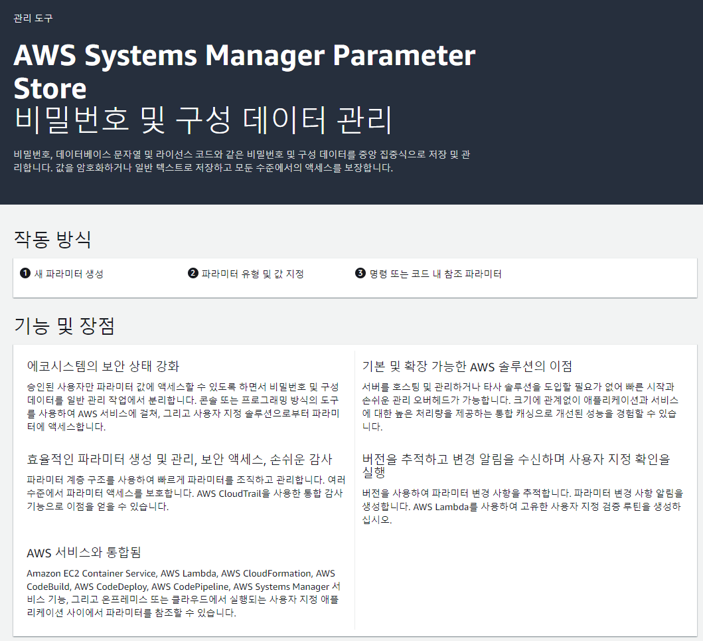
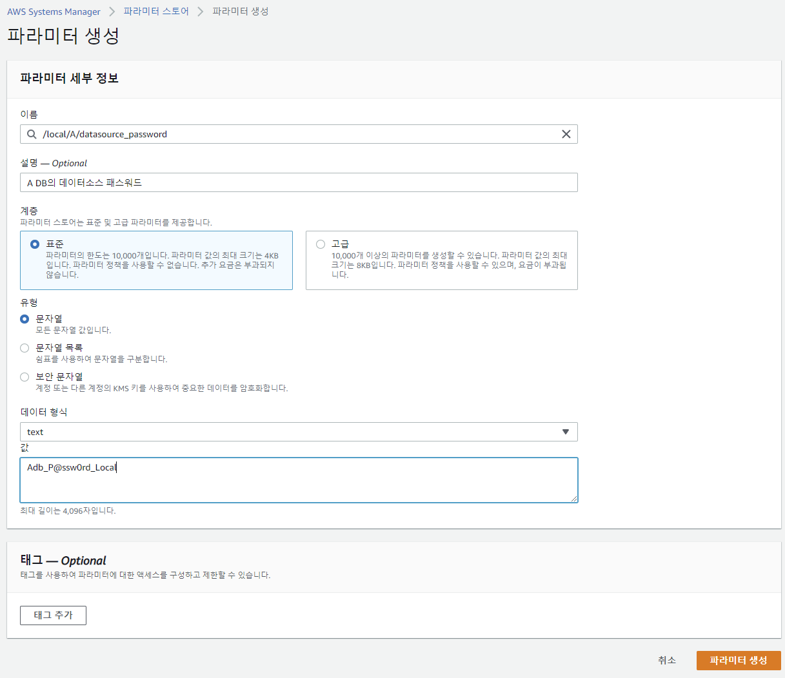
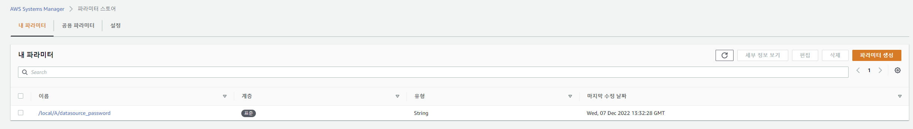
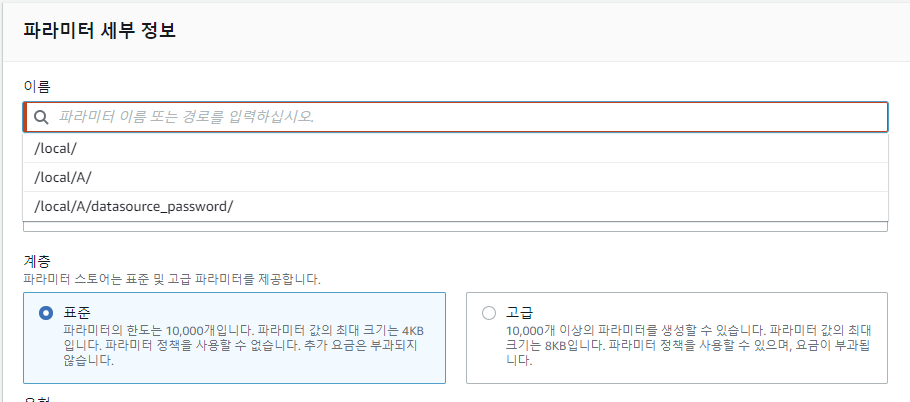

# Spring Boot에서 AWS Parameter Store로 환경설정정보 사용하기

## 왜 소스 내 패스워드를 하드코딩하면 안될까?
기본적으로 Spring Framework에서 제공하는 JDBC Datasource를 작성할 때는, application.yaml(application.properties) 내 정해진 key값에 따라 작성하고 이를 주입하여 DB Connection 객체를 생성한다.
Datasource 빈을 직접 작성하여 주입할 수도 있다. 다들 한번쯤 설정해봤을 것이다.

그뿐만 아니라, 다양한 인증 정보들을 application.yaml 내에 기재하여 환경 설정 정보를 사용한다.

```yaml
spring:
    datasource:
        url: jdbc:mysql://localhost/~/db
        username: username
        password: P@ssw0rd!
        driver-class-name: org.h2.Driver
```

그런데 사실 우리는 이처럼 application.yml에 민감한 패스워드 정보나 노출되어서는 안되는 secret 값들을 소스 내에서 관리한다는 것 자체가 보안상 얼마나 위협이 되는지를 인지해야 한다.

KISA 소프트웨어 개발보안 가이드(2021)를 보면 6.하드코드된 중요정보 에서는 이렇게 이야기 한다.
> - 프로그램 코드 내부에 하드코드된 패스워드 또는 암호화키를 포함하여 내부 인증에 사용하거나 암호화를 수행하면 중요정보가 유출도리 수 있는 보안 약점이다.
> - 패스워드는 암호화 하여 별도의 파일에 저장하여 사용한다. 또한 중요정보를 암호화하면, 상수가 아닌 암호화 키를 사용하도록 하며 소스코드 내부에 상수형태의 암호화키를 저장해서 사용하지 않도록 한다.

결론은 소스코드 내 비밀번호 또는 중요 정보를 담고있으면 소스코드 유출 시, 중요 정보도 유출될 수 있으니 소스 코드내 저장하지 말라는 의미이다.

기존에는 비밀번호를 담은 파일을 별도로 숨김 파일로 관리하는 등의 방식을 사용했었다. 실제 외부에 있는 저장 매체 내 존재하는 파일을 불러와 암호화된 패스워드를 복호화하여 사용하는 방식이었다.

요즘은 더 현대적인 방법을 사용한다. 대표적으로 Spring Cloud 에서 제공하는 config server를 사용하는 방법이 있다. 이러한 보안 이슈를 고려하는 업체에서
가장 대중적으로 사용하는 방법이라고 생각한다.

또 다른 방법으로는 이번 포스트에서 소개되는 AWS의 Parameter Store라는 것을 사용할 수 있겠다.
AWS Parameter Store는 외부에서 키를 관리할 수 있도록 config server와 유사한 방식으로 기능을 제공한다.

그러면 이 Parameter Store가 무엇인지 알아보자.

## AWS Parameter Store란?

Parameter Store는 AWS Systems Manager 서비스에 포함되는 서비스이다. 작업 관리, 애플리케이션 관리, 변경 관리, 노드 관리 중 애플리케이션 관리 서비스에 속한다.

이 파라미터 스토어는 구성 데이터 관리 및 secret 관리를 위한 안전한 계층적 스토리지를 제공한다고 소개한다. 계층적 스토리지라는 표현은 파라미터 스토어를 다루다보면 이해하겠지만,

이 파라미터 스토어의 이름이 계층 구조 형태를 띈다. 이를테면, 박선용 사용자의 a라는 서비스 내 사과, 바나나, 파인애플 이라는 파라미터 이름으로 특정 값을 저장한다면,

- /박선용/a/사과
- /박선용/a/바나나
- /박선용/a/파인애플

과 같은 형태로 파라미터 이름을 작성한다. 이러한 계층형 구조로 파라미터를 저장하는 스토리지 구조를 가지고 있다.

또한 특정 파라미터에 저장할 값을 일반 텍스트 또는 암호화된 데이터로 저장할 수 있다.
사과라는 파라미터에 저장되는 데이터가 "는 맛있다" 라는 일반 텍스트 형태로도 저장할 수 있지만, 암호화할 만큼 중요한 데이터라면 이를 AWS KMS를 사용하여, 암호화하고 저장할 수 있다.

부가적으로, 특정 파라미터의 값이 변경되면 변경을 감지하여 이를 알림할 수 있도록 AWS EventBridge와도 연동할 수 있다. 다룰 수 있는 범위가 상당히 포괄적이다.

이번 포스팅에서 다룰 핵심 주제는 SpringBoot내 application.yml에 기재한 하드코딩된 패스워드를 AWS의 Parameter Store로 변경하는 것이다.

## AWS Parameter Store를 사용하여, Spring Boot의 환경설정 정보 다루기

### AWS Parameter Store에서 파라미터 생성
제일 먼저할 일은 어떠한 데이터를 외부에서 다룰 것인가를 결정해야한다.
일반적인 URL이나, 단순 설정과 같은 정보들보다 노출될 경우 민감한 정보가 될 수 있는 것들을 주로 다룬다.

보편적으로 패스워드나 secret 값, 인증정보 등이 이에 해당한다.

대표적으로 많이 사용하는 `spring.datasource.password`가 대표적이지 않을까 싶다.
이 포스팅에서는 `spring.datasource.password`의 값을 Parameter Store로 관리하고 이를 애플리케이션 구동시점에 정상적으로 읽어, DB커넥션이 정상적으로 이루어지는지를 확인하겠다.

먼저 AWS의 Parameter Store 서비스로 이동하자.

우측 상단에서 파라미터 생성버튼을 클릭하여 이동하자.


파라미터 세부 정보를 입력하면 아주 간단히 파라미터를 생성할 수 있다.

이름은 계층형태 즉, 경로 형태로 입력한다. 사실 이 계층형을 사용하면, 프로젝트 정책에 따라 효율적으로 관리할 수 있다.
이를테면, 내 프로젝트에서는 local,stage, live 프로파일별로 환경설정을 구성하고, 각각 서로 다른 데이터베이스를 쓴다고 가정해보겠다.
그리고 여러 데이터베이스를 써야해서, datasource를 여러개를 작성해야한다고 상황을 가정해보겠다.

나는 local, stage, live 마다 서로 다른 A와 B 데이터베이스를 관리해야 한다.
- local - A DB
- local - B DB
- stage - A DB
- stage - B DB
- live - A DB
- live - B DB

나는 이 형태를 계층적으로 관리하기 위해서 이런 형태를 만들 예정이다.
- /local/A/datasource_password
- /local/B/datasource_password
- /stage/A/datasource_password
- /stage/B/datasource_password
- /live/A/datasource_password
- /live/B/datasource_password



파라미터 생성이 완료되었다.



다음 나머지 5개도 이와같은 방식으로 만들 것이다.

어라? 만들려고 보니 계층에 대해 자동완성 되고 있다.


아주 좋은 기능이다.

다음은 Spring Boot에서 이렇게 만든 파라미터를 읽어와 사용할 수 있도록 처리해보자.

### Spring Boot 설정하기

