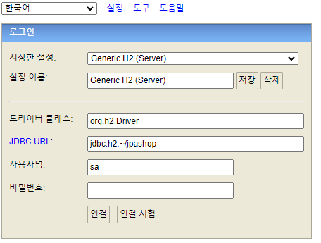

# TIP

### 모든 데이터 및 테이블 삭제

```bash
drop all objects
```

FK, Index 등 연관 관계를 모두 무시하고 모든 데이터를 일괄 삭제해준다.

---

### 파일 모드와 네트워크 모드

h2 데이터베이스는 파일 모드와 네트워크 모드로 데이터베이스와 통신을 수행할 수 있다.

파일 모드로 접근할 경우, 다른 커넥션이 접근할 수 없는 문제 또는 정합성 문제가 발생할 수 있기 때문에, 최초에 DB를 생성할 때만 파일 모드를 사용하고, 이후에는 네트워크 모드를 사용하여 커넥션을 맺는 것을 추천한다.

최초 DB를 생성하면, 작성된 파일 경로에 따라 {파일경로}.mv.db 파일이 생성된다. 이후부터는 네트워크 모드로 DB에 접근하면 된다.

**파일 모드**

```
//JDBC URL 
jdbc:h2:{파일 경로}
```

**TCP 모드**

```
//JDBC URL
jdbc:h2:tcp://localhost/{파일 경로}
```

**예제)**

1. 브라우저에서 localhost:8082 접근
- JDBC URL을 아래와 같이 작성하여 파일 모드로 DB 초기 생성 및 접근



1. 좌측 상단에 Disconnect 버튼 클릭하여 초기 화면으로 이동


1. 네트워크 모드로 접근


---