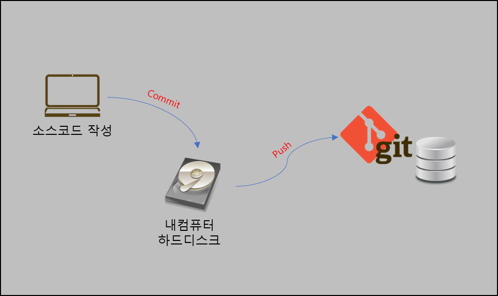
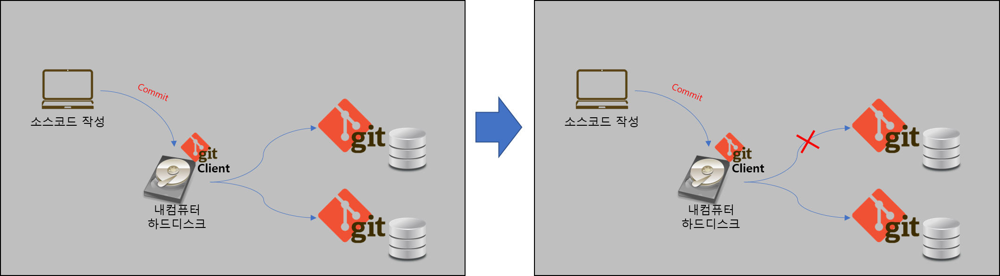
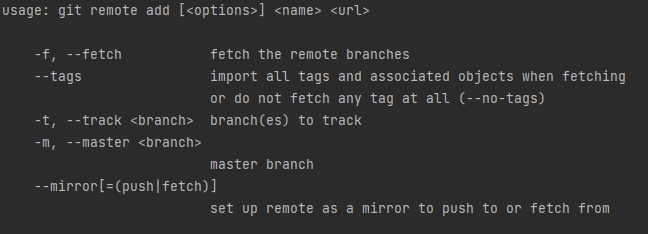
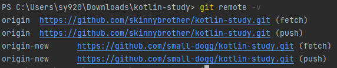

# Git 저장소 변경하기

## 들어가기 앞서..
Git은 알다시피 로컬(Local) 저장소와 Remote(원격) 저장소가 구분되어있다.
우리가 작업한 작업물(Local Changes)은 Locally하게 나의 로컬 저장소에 1차 기록한다.
그 행위를 Commit이라고 한다.

Commit이 이루어지면 1차적으로 내가 작업한 작업물에 대한 내용과 함께 고유 ID에 해당하는 Revision이 부여되고,
부가적으로 Commit Message를 기록하여, 해당 Commit을 식별할 수 있다. 따지고보면 Revision은 Commit의 ID이고,
Commit은 원격지에 배포(Push)하기 전, 저장물에 해당한다고 볼 수 있을 것 같다.

Commit 후, 또다른 Commit으로 일정 작업물을 모아서 배포(Push)할 수도 있고, Commit과 Push를 동시에 진행하여 원격지로 바로 보낼 수있다.



우리는 이 원격지를 원격 저장소(Remote Repository) 라고 부른다.
통상적으로는 Git 저장소를 최초 클론하게되면, 이름이 자동으로 `origin`으로 부여된다.

아래 명령을 통해, 현재 저장소의 정보를 확인할 수 있다.
```shell
git remote -v
```

그러면 원격 저장소를 어떻게 변경할 수 있을까?

## 원격 저장소를 변경해보자.

저장소를 변경하기 위해서는 아래의 그림과 같이, 원격 저장소를 추가하여 나의 Git 클라이언트가 두 곳의 원격 저장소를 바라보도록 하고,
기존 연결을 끊어버리면 된다.


먼저, 저장소를 추가하자. 아래의 커맨드에서 `git remote #{원격저장소 식별자} #{원격 저장소 git 주소}` 순으로 작성하면 된다.
원격저장소 식별자는 식별용이기 때문에 보기 편한걸로 작성하면된다. 통상적으로 자동 생성되는 origin으로 어차피 변경될 저장소의 식별자를 변경할 것이다.



```shell
git remote add origin-new https://github.com/small-dogg/kotlin-study.git
```

그리고 정상적으로 추가되어 총 두 곳의 원격 저장소를 바라보고 있는지 확인하자.
```shell
git remote -v
```



총 두개의 저장소가 추가된 것을 확인할 수 있다.

자 이번엔 새로운 저장소에 기존 저장소의 모든 내역을 복사해보자.
먼저, 전체 브랜치를 모두 로컬 저장소로 체크아웃 한 뒤, 전체적으로 pull을 받아, 이를 새로운 저장소로 푸시해야한다.

아래의 명령을 통해, 브랜치를 전체 조회하여, 브랜치를 개별적으로 트래킹하고, 트래킹된 모든 브랜치를 fetch 및 pull한다.
```shell
git branch -r | grep -v '\->' | sed "s,\x1B\[[0-9;]*[a-zA-Z],,g" | while read remote; do git branch --track "${remote#origin/}" "$remote"; done
git fetch --all
git pull --all
```

그러면 전체 브랜치라 Local Branch로 내려받아지고, 전체 최신 상태로 업데이트할 수 있다.

그러면 해당 Local Branch(원격저장소로부터 가져온 모든 최신 내역)을 신규 추가한 원격 저장소로 푸시하자.
```shell
git push --all origin-new
```

이젠, 기존의 원격 저장소를 삭제하고, 신규 추가한 원격저장소의 식별자를 origin으로 변경하자.
```shell
git remote rm origin
git remote rename origin-new origin
```

보통 IDE에서 이 작업을 수행하면, 로컬 브랜치가 이전 원격 저장소를 바라보고 있기 때문에, 푸시할 때 에러메시지가 발생한다.
이럴때는 upstream을 직접 수행해주면 되는데, 푸시를 수행할 때, 업스크림을 직접 설정하거나, IDE의 도움을 받으면 된다.

```shell
git push -u origin main
```