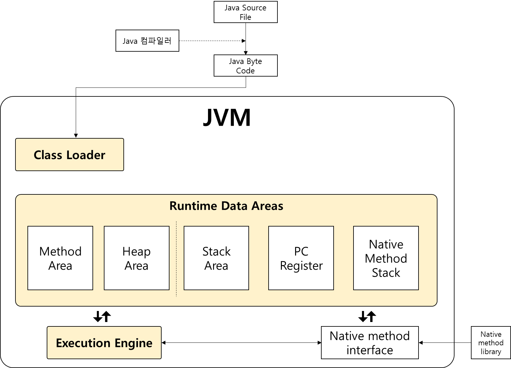

# JVM과 가비지 컬렉션

# JVM

## JVM에 들어가기 앞서

자바 가상머신(Java Virtual Machine,JVM)은 **자바 바이트 코드를 실행할 수 있는 주체**이다. 일반적으로 인터프리터나 JIT 컴파일 방식으로 다른 컴퓨터 위에서 바이트코드를 실행할 수 있도록 구현되나 자바 프로세서처럼 하드웨어와 소프트웨어를 혼합해 구현하는 경우도 있다.

자바는 **플랫폼에 독립적**이며, 모든 JVM은 자바 가상 머신 규격에 정의된 대로 자바 바이트 코드를 실행한다. 따라서 표준 자바  API까지 동일한 동작을 하도록 구현한 상태에서는 이론적으로 모든 자바 프로그램은 CPU나 운영 체제의 종류와 무관하게 동일하게 동작할 것을 보장한다.

좀더 쉽게 설명하면, 일반적으로 다른 언어들의 경우 OS와 CPU 아키텍처에 따라서 그 플랫폼에 알맞게 바이트 코드로 변환해야 하고, 그렇기 때문에 플랫폼에 종속적이다. 여기서 플랫폼이란 개발 환경 실행 환경 등 어떠한 목적을 수행할 수 잇는 환경 정도로 이해하면 된다. 하지만 JAVA는 운영체제나 CPU 등 플랫폼에 상관없이 JVM만 있으면 어떠한 플랫폼에서도 동일하게 실행된다. 이를 **WORA(Write Once Run Anywhere)**라고한다. 즉, 한번만 작성해두면 어디서든 실행될 수 있다는 뜻이다.

Java가 WORA를 실현할 수 있는 이유는 JVM와 바이트 코드가 있기 때문이다.

바이트 코드는 자바 컴파일러가 자바 소스프로그램을 컴파일한 기계어이다. 우리가 자바 소스코드를 javac를 통해 컴파일을 하게 되면 `.class` 파일이 생성되는데, 이것이 바이트 코드이다. 

위에서 Java가 플랫폼에 독립적이라고 표현했다시피, Java의 바이트 코드는 **CPU에 의해 직접 실행하지 않고**, JVM에 의해 **인터프리터 방식**(또다른, **JIT 컴파일링 방식**도 있음)으로 한 명령씩 해석되어 실행한다.

다시 말해, Java는 사용자에 의해 프로그래밍 된 소스코드를 자바 컴파일러를 통해 바이트코드로 컴파일링하고, 이렇게 컴파일링된 소스코드를 JVM을 통해 인터프리터 방식이나 JIT 컴파일링 방식을 통해 소스코드를 해석해서 컴퓨터가 처리한다.

그러면 이렇게 프로그램을 동작시키는데 중추적인 역할을 수행하는 JVM에 대해서 구조적으로 이해해보자.

## JVM의 구성

JVM은 크게 **Class Loader**, **Runtime Data Areas**, **Execution Engine** 으로 구성되어있다.

- **Class Loader**

클래스 로더는 Runtime 시점에 클래스를 로드하며, 클래스의 인스턴스를 생성하면 클래스 로더를 통해 메모리에 로드(Runtime Data Area의 적시적소에 데이터를 로드)한다.

- **Runtime Data Areas**

Runtime Data Areas는 JVM이 프로그램을 수행하기 위해 운영체제로부터 할당받은 메모리 공간이다. 클래스 로더에 의해 데이터가 각각의 영역에 해당하는 메모리 공간에 할당된다.

- **Execution Engine**

Class Loader에 의해 JVM으로 로드된 바이트코드들은 Runtime Data Area의 Method Area에 배치되는데, JVM은 Method Area의 바이트 코드를 Execution Engine에 제공하여, Class에 정의된 내용대로 바이트코드를 실행시킨다. 이때, 로드된 바이트코드를 실행하는 Runtime Module을 Execution Engine이라고 부른다.

먼저 JVM의 구성에 대해 간략하게 알아봤다. 그러면 각각의 구성이 어떤식으로 동작하는지에 대한 동작원리를 이해해보자.

### Class Loader

- **Class Loader system**

자바의 동적 클래스 로딩 기능은 클래스로더 서브시스템에 의해서 처리된다. 컴파일 타임이 아닌 클래스를 처음 참조하는 런타임을 수행할 때, 클래스 파일을 로딩하고 연결하고 초기화하는 작업이 이루어진다.

### **로딩**

바이트코드 파일을 읽어서 바이너리 코드로 만들고 이를 Runtime Data Areas의 Method Area에 저장하는 과정이다.

로딩과정에서 저장하는 데이터는 다음과 같다.

- FQCN(Fully-Quailified Class Name)
    - 클래스 로더, 클래스 패키지 경로, 패키지 이름, 클래스 이름을 모두 포함한 값
    - ex) java.lang.Character$Subset
- Class, Interface, Enum을 구분하여 저장
- 메서드와 변수

로딩이 끝나면 해당 클래스 타입의 객체를 생성하여 Heap Area에 저장한다.

Java는 기본적으로 3가지의 클래스 로더가 존재한다.

- **BootStrap ClassLoader**

3가지의 기본 클래스 로더 중 최상위 클래스로더이다. 이 클래스로더는 rt.jar 파일을 로드하는데, rt.jar에서 rt는 runtime을 의미하며, 자바 프로그램을 실행하는데 필요한 클래스들이 들어있는 파일이다. 예를 들어 String과 같은 원시 클래스 파일이 rt.jar에 포함된다. Java 9 부터는 rt.jar파일도 여러개로 쪼개졌다.(**@todo** 여러개로 쪼개진 것 내 눈으로 나중에 확인하기)

- **Extension ClassLoader(Platform ClassLoader)**

Bootstrap ClassLoader의 자식으로 jre/lib/ext나 java.ext.dirs에 위치한 자바의확장 클래스를 로드한다.(**@todo** jre/lib/ext 확인하기)

- **Application ClassLoader(App ClassLoader)**

Extension ClassLoader의 자식으로 classpath 환경 변수로 지정된 클래스를 로드한다.

**동작 원리**

1. 클래스를 참조하게 되면 먼저, 메모리의 Heap 영역에 사전에 ClassLoader에 의해 로딩된 대상이 있는 지 확인을 한다.
2. 로딩된 대상이 있으면 그 대상을 사용한다.
3. 없으면, JVM은 ClassLoader Sub System에 해당 클래스를 로드하도록 요청한다.
4. 요청을 전달받은 ClassLoader Sub System은 Application ClassLoader에게 대상 클래스를 요청한다.
5. 요청을 전달받은 Application ClassLoader는 대상 클래스를 찾고 없으면 부모인 Extension ClassLoader에게 위임한다.
6. 위임받은 Extension도 마찬가지로 클래스를 찾고 없으면 부모인 Bootstrap ClassLoader에게 요청한다.
7. 결과적으로 그 어느 ClassLoader라도 찾고있는 Class를 탐색했으면 탐색된 대상을 로딩하고 반환한다.
8. 그런데 최상위 클래스로더인 Bootstrap ClassLoader까지도 대상 Class를 가지고 있지않는다면 **ClassNotFoundException**이 발생하게 된다.

### **링크**

링크는 로딩된 클래스를 Verify, Prepare, Resolve단계를 수행한다.

- **verfiy**

컴파일이 잘 되었는지 확인하는 절차이다.

.class 파일 형식이 올바른지 확인한다.

ClassLoader Sub System안에 위치한 ByeCode verfier가 위의 역할을 수행한다.

- prepare

메모리를 준비해는 단계이다.

이 단계에서는 JVM은 클래스 또는 인터페이스의 정적 변수를 메모리에 로드하고 기본 값을 설정한다.

- resolve

컴파일 시점에 자바 클래스는 다른 클래스의 실제 주소 값을 자리 못한다.

실제 주소값 대신 symbolic references가 이 역할을 대체한다.

resolve 단계에서 런타임 constant pool에 symbolic references의 구체적인 값을 지정한다.

### **초기화**

모든 정적 변수가 기본 값에서 지정된 값으로 초기화 되고 block이 위에서 아래로, 부모에서 자식으로 실행된다.

### Runtime Data Areas

1. Method Area
- JVM이 실행되면서 생성되는 공간이다.
- Class에 대한 정보, 전역 변수 정보, Static 변수 정보가 저장되는 공간이다.
- Runtime Constant Pool은 말 그대로 ‘상수’ 정보가 저장되는 공간이다.
- 모든 스레드에서 Method Area의 정보가 공유된다.
1. Heap
- new 연산자로 생성된 **인스턴스**, Array와 같은 **동적으로 생성된 데이터**가 저장되는 공간이다.
- Heap에 저장된 데이터는 GC가 처리하지 않는 한 소멸되지 않는다.
- **Reference Type의 데이터**가 저장되는 공간이다.
- 모든 스레드에서 정보가 공유된다.
1. Stack
- 지역변수, 메소드의 매개변수와 같이 잠시 사용되고 필요가 없어지는 데이터가 저장되는 공간이다.
- 원시타입의 데이터가 값과 함께 할당된다.
- Last In First Out, 나중에 들어온 데이터가 먼저 나간다.
- 만약, 지역변수 이지만 Reference Type일 경우에는 Heap에 저장된 데이터의 주소값을 Stack에 저장해서 사용하게 된다.
- 스레드마다 하나씩 존재한다.
1. PC Register
- 스레드가 생성되면서 생기는 공간이다.
- 스레드가 어느 명령어를 처리하고 있는지 그 주소를 등록한다.
- 현재의 처리하고있는 위치 정보를 저장하는 역할
1. Native Method Stack
- Java 가 아닌 다른 언어(C, C++)로 구성된 메소드 실행이 필요할때 사용하는 공간이다.

### **Execution Engine**

Class Loader에 의해 JVM으로 Load된 Class 파일(바이트코드)들은 Runtime Data Areas의 Method Area에 배치되는데, JVM은 Method area의 바이트 코드를 Execution Engine에 제공하여, Class에 정의된 내용대로 바이트 코드를 실행시킨다. 이때, Load된 바이트코드를 실행하는 Runtime Module을 Execution Engine이라고 부른다.

Execution Engine은 두가지 방식을 혼합하여 사용한다.

1. Interpreter 방식

바이트 코드를 한줄씩 실행하는 방식이다. 초기 방식으로 속도가 느리다는 단점을 가지고 있다.

1. JIT(Just In Time) 컴파일 방식과 동적 번역(Dynamic Translation)

그래서 나온 것이 JIT 컴파일 방식이다. 바이트코드를 JIT 컴파일러를 이용해 프로그램을 실제 실행하는 시점에 각 OS에 맞는 Native Code로 변환하여 실행 속도를 개선하였다. 하지만, 바이트코드를 Native Code로 변환하는 데에도 비용이 소요되므로, JVM은 모든 코드를 JIT 컴파일러 방식으로 실행하는 것은 아니고, 인터프리터 방식을 사용하다가 일정 기준이 넘어가면 JIT 컴파일 방식으로 명령어를 실행한다.

또한, JIT 컴파일러는 매번 코드를 해석하는 것이 아니라, 한번 해석된 코드는 캐싱 후, 다시 그 코드를 호출했을 때 캐싱된 코드를 사용한다.

**Stack과 Heap**

### **Garbage Collection**

JVM의 힙 영역에서 사용하지 않는 객체를 제거하는 작업을 총칭한다. 객체를 제거하는 작업을 수행하는 이유는 자바의 경우 메모리를 직접 해제해줄 수 없는 언어이기 때문이다. 따라서 객체를 사용하고 제거하는 기능이 필요하다.

그러면 어떻게 힙 영역에서 사용되지 않는 객체를 선별하고 제거를 할까?

**Mark and Sweep**

가비지 컬렉터에는 GC Root라는 개념이 존재한다. GC Root는 힙 외부에서 접근할 수 있는 변수나 오브젝트를 뜻한다. GC Root는 말그대로 가비지 컬렉션의 Root이다.

GC Root는 

- 실행 중인 쓰레드
- 정적 변수
- 로컬 변수
- JNI 레퍼런스

들이 될 수가 있다.

Heap영역에서 GC Root가 참조되고 있는 대상을 Marking하고, 참조되고있지 않은 메모리들을 해제하여 Heap 영역으로부터 제거한다. 이를 Sweep이라고 한다.

Heap은 YG와 OG로 구분된다. YG는 새로운 객체들이 할당되는 영역이고, OG는 YG에서 오랫동안 살아남은 객체들이 존재하는 영역이다. 

YG는 Eden, Survivor0, Survivor1 영역으로 나뉘게 된다.

