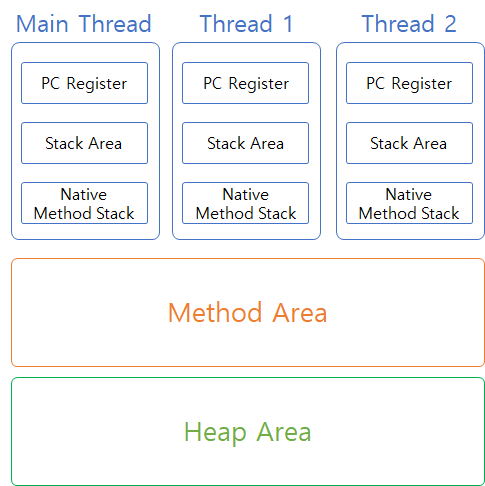

# ThreadLocal

ThreadLocal은 JDK1.2에서부터 제공된 오래된 클래스이다. 이 클래스를 사용하면 멀티 스레드 환경에서도 스레드 단위로 로컬 변수를 사용할 수 있다. 때문에  싱글톤객체에 대해 멤버변수 처럼 멀티 스레드가 동시에 접근할 수 있는 변수같은 경우 동시성 문제를 발생시킬 수 있어 이 때 ThreadLocal을 사용할 수 있다.

이 동시성 문제가 발생하는 이유는 전역변수나 멤버변수와 같은 경우 멀티 스레드 환경에서 동시에 스레드가 접근하게 되면, 힙영역에 존재하는 이 전역변수나 멤버변수를 함께 사용할 수 있게 되는데, 이 때 서로 다른 스레드가 예기치 않은 값을 갖게될 때 발생할 수 있다.



```java
public class SingletoneClass {
    //Instance
    private static SingletoneClass instance = new SingletoneClass();

    //private construct
    private ExampleClass() {}

    public static SingletoneClass getInstance() {
        return instance;
    }
}
```

말이 좀 어려울 수 있으니 위의 그림을 가지고 설명을 해보자.

Singletone 객체는 위의 `SingletoneClass` 보자. Singletone 객체 즉, 하나의 인스턴스만 제공하기 위해, 개별 생성자를 제공하지 않았고, getInstance 메서드를 통해, static 객체만 제공하도록 되어있다.

이 Singletone 객체가 JVM에서는 Method Area에 할당되게 된다. 이 Method Area는 모든 스레드가 함께 공유하는 영역이다. 때문에 Singletone 객체를 여러 스레드에서 동시에 접근할 수 있는 것이다.

그러면 추가적인 예시를 한가지 더 들어보자. 조금 극단적인 예시이긴하지만, private 접근 제어자에 해당하는 int a 참조변수를 만들어 값을 할당했다. 그리고 이 값을 더해주는 add 메서드를 추가하였다.

```java
public class SingletoneClass {
    //Instance
    private static SingletoneClass instance = new SingletoneClass();
		private int a = 3;

    //private 생성자
    private void ExampleClass() {}

    public static SingletoneClass getInstance() {
        return instance;
    }

		public int add(){
			return ++a;
		}
}
```

`a` 라는 멤버변수가 추가되었고 초기값은 3이다.

그리고 아래와 같이 이 Sinletone 객체를 사용하는 서로 다른 두 스레드가 있다고 가정해보자.

```java
public class ThreadLocalTest {
    public static void main(String[] args) {
        Thread thread1 = new Thread(new AThread());
        Thread thread2 = new Thread(new BThread());
        thread1.run();
        thread2.run();
    }

     static class AThread implements Runnable{
         @Override
         public void run() {
             SingletoneClass sc = SingletoneClass.getInstance();
             System.out.println(sc.add());
         }
     }

     static class BThread implements Runnable{
         @Override
         public void run() {
             SingletoneClass sc = SingletoneClass.getInstance();
             System.out.println(sc.add());
         }
     }
}

```

AThread는 싱글톤 객체 내부의 공유 변수 a 값을 5로 바꾸었다.

BThread는 싱글톤 객체 내부의 공유 변수 a 값을 출력하였다.

당연히 공유 변수이니 값의 결과는 5일 것이다. 각 스레드는 4일 것이라고 생각하였지만 그렇지 못하였다.

이러한 부분이 동시성 문제의 예시이다. 멀티 스레드환경에서 싱글톤 객체를 공유해서 사용하다보니, 여러 스레드가 접근하면서 변경되면 안되는 값이 변경되어 버리면 동시성 문제가 있다고 볼 수 있다.

Spring에서는 각각의 빈들은 별도의 스코프를 지정하지 않으면 Singletone 스코프를 기본값으로 사용한다. 떄문에, 이 빈 안에서 공유될 수 있는 `상태를 갖는` 멤버 변수를 사용하게 되면 원치 않는 결과가 나올 수도 있다. 이러한 부분을 굉장히 조심해야한다.

공유자원을 놓고 여러 스레드가 읽기/쓰기 작업을 수행하면서 데이터에 문제가 생긴 것이다.

그럴때 사용할 수 있는 방법이 바로 ThreadLocal이다. 이 Thread Local은 정적 또는 전역 메모리를 스레드에 로컬로 사용할 수 있도록 도와주는 클래스이다. 그러니깐 다시말해서 정적이거나 전역 메모리인 대상을 스레드 각각마다 개별적으로 갖게 해주는 역할을 수행한다고 생각하면 될 것 같다.

위의 예시에서 a 변수가 ThreadLocal이었다면, AThread와 BThread는 a 변수를 개별적으로 갖고있어서 이런 동시성 문제를 해결할 수 있을 것이다.

그러면 위의 예시를 ThreadLocal로 변경해서 다시한번 보도록 하자.

```java
public class SingletoneClass {
//Instance
    private static SingletoneClass instance = new SingletoneClass();
    private int a = 3;
    private static ThreadLocal<Integer> b = new ThreadLocal<>();

    //private construct
    private void ExampleClass() {}

    public static SingletoneClass getInstance() {
        b.set(3);
        return instance;
    }

    public int add() {
        b.set(b.get()+1);
        return b.get();
    }
}
```

```java
public class ThreadLocalTest {
    public static void main(String[] args) {
        Thread thread1 = new Thread(new AThread());
        Thread thread2 = new Thread(new BThread());
        thread1.run();
        thread2.run();
    }

     static class AThread implements Runnable{
         @Override
         public void run() {
             SingletoneClass sc = SingletoneClass.getInstance();
             System.out.println(sc.add());
         }
     }

     static class BThread implements Runnable{
         @Override
         public void run() {
             SingletoneClass sc = SingletoneClass.getInstance();
             System.out.println(sc.add());
         }
     }
}

```

싱글톤 클래스 안에 ThreadLocal타입으로 Integer타입을 지정하였고, getInstance 호출로 싱글턴 객체를 호출할 때, 값을 3으로 초기화 하도록 하였다.

그리고 마찬가지로 ThreadA와 B를 시작하였다. 그결과 둘다 4를 갖게되었다. 바로 ThreadLocal이 각 스레드마다 값을 갖도록 해준 덕분이다. 정말 스레드마다 별도의 객체를 갖는지 확인하려면 주소를 찍어보면된다.

이정도를 이해하면 어떤 느낌인지감이 올 것 같다.

그러면 ThreadLocal클래스가 제공하는 메서드를 한번 살펴보자.


초록색 자물쇠로 열려있는 것이 public 메서드이다. get(), remove(), set(), withInitial() 이 4가지가 저부이다.

`get()`

get은 ThreadLocal 특정 타입으로 입력받은 값을 꺼낼때 사용하는 메서드이다. 위의 예시에서 add메서드를 보면, get메서드를 사용하여 값을 꺼낸것을 알 수 있다.

`set()`

ThreadLocal에 값을 입력하는 메서드이다. 위의 예시에서 set을 통해 1을 더한 값을 넣은 것을 알 수 있다.

`remove()`

ThreadLocal은 ThreadPool 내 특정 Thread의 static 변수이기 때문에, 만약 스레드가 종료됐음에도 불구하고 ThreadLocal 변수 내 값을 제거하지 않으면 다른 요청이 해당 Thread를 점유했을 때, 값이 남아있을 수 있다. 때문에 반드시 제거해줘야한다.

`withInitial()`

해당 메서드는 JDK 1.8부터 새롭게 추가된 메서드이다. Supplier형태로 값을 초기화과정에 지정할 수 있다. 위의 예시에서는 getInstance()메서드를 호출할때 값을 초기화 해주었지만, withIntial 메서드를 활용하면 위에서 참조변수를 생성함과 동시에 초기화도 가능하다.

```java
ThreadLocal<Integer> tl = ThreadLocal.withInitial(Random::new);
```

원래 ThreadLocal에서 권고하는 초기화 방법은 initialvalue 메서드를 오버라이드하여 직접 초기값을 지정해주는 방법이다.

```java
private static ThreadLocal<Integer> b = new ThreadLocal<>(){
    @Override
    protected Integer initialValue() {
        return 3;
    }
};
```

위의 내용을 람다표현식으로하면,

```java
private static ThreadLocal<Integer> b = ThreadLocal.withInitial(() -> 3);
```

이렇게 표현될 수 있다.

사실 1.8부터 추가된 함수형 인터페이스이긴하나, 기존 initialValue를 사용하는 것이다.

여하튼, 초기화할 때는 값을 직접 set으로 초기화해줄수도있고, 아래의 내용처럼 withInitial 또는 initialValue를 재정의하는 방법등이 있다.