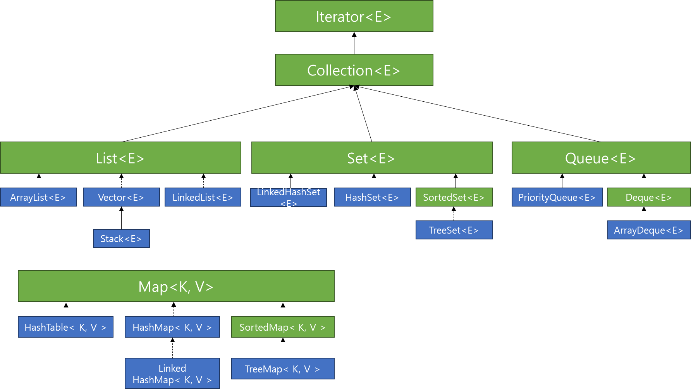

# 컬렉션 프레임워크

# 컬렉션 프레임워크란

컬렉션 프레임워크란 자바에서 다수의 데이터를 쉽고 효과적으로 처리할 수 잇는 표준화된 방법을 제공하는 클래스의 집합이다.

이 컬렉션 프레임워크는 자바의 인터페이스를 사용하여 구현된다.



컬렉션 프레임워크는 Collection 인터페이스를 구현하는 List, Set, Queue 인터페이스로 구성되어있으며, 추가적으로 Map인터페이스까지 포함하여 컬렉션 프레임워크라고 부릅니다.

여기서 Map이 Collection인터페이스의 구현체가 아닌 이유는 Collection 인터페이스과 다르게 Map의 경우 Key와 Value를 한쌍으로 이루어지는 데이터 집합이기 때문이다.

하지만 Collection과 Map 모두 다수의 데이터를 쉽고 효과적으로 처리할 수 있다는 점에서 컬렉션 프레임워크에서 Collection과 Map을 모두 이야기 한다.

# 컬렉션 프레임워크의 종류

- 리스트(List) : 인덱스 순서로 요소를 저장한다. 중복된 데이터를 저장할 수 있다.
- 집합(Set) : 순서를 보장하지 않으며, 데이터를 중복하여 저장할 수 없다.
- 큐(Queue) : 데이터가 저장된 순서대로 출력되는 선입선출 구조를 갖는 선형 자료구조이다.
- 맵(Map) : Key-Value 쌍으로 데이터를 저장한다. 순서를 보장하지 않으며, Key가 중복될 수 없다.

## List

리스트는 저장된 요소들을 인덱스를 기반으로 순서를 관리하고, 데이터가 중복될 수 있다.

리스트는 크게 ArrayList와 LinkedList로 나뉜다.

리스트는 크기 조절이 가능하다.

초기화 과정에서 크기를 확정해야하는 배열과 다르게, 초기 크기를 지정하지 않아도 된다.

리스트에서 삭제는 공간을 지우는 것이다.

```java
List<자료형> arrayList = new ArrayList<>();
List<자료형> linkedList = new LinkedList<>();
```

각각 ArrayList와 LinkedList를 선언하는 방법이다. new 연산자를 사용하여 구현체의 인스턴스를 만들어 선언한다. 

리스트는 특징에 맞게 아래의 주요 기능을 제공한다.

### List의 주요기능

| add(value) | 값을 리스트에 삽입한다. |
| --- | --- |
| add(index, value) | 값을 특정 index에 삽입한다.
만약 2번에 삽입을하면, 기존의 2번자리에 있던 요소부터 인덱스가 한칸씩 밀리게 된다. |
| set(index, value) | 특정 인덱스에 있는 값을 인자로 넘어온 값으로 치환한다 |
| remove(index) | 특정 인덱스에 위치한 값을 삭제한다. |
| clear() | 모든 요소를 삭제한다 |
| get(index) | 해당 인덱스에 위치한 요소를 조회한다. |
| size() | 리스트의 인덱스 길이를 조회한다. |

### **ArrayList**

ArrayList는 요소를 순차적으로 추가하는 특징을 가지고 있다. 배열과 매우 유사하며 배열은 배열 선언시 크기를 지정해줘야 하는 반면, ArrayList는 동적으로 크기를 조정한다.

### **LinkedList**

LinkedList는 인덱스가 서로 연결되어있는 특징을 가지고 있다. 각각의 인덱스는 이전과 이후의 인덱스 주소를 알고 있다.

**ArrayList vs LinkedList**

그러면 언제 ArrayList를 사용하고 언제 LinkedList를 사용해야할까?

위에서 언급한 List의 주요 기능중 하나인 remove(index) 메서드를 각 ArrayList와 LinkedList에서 사용하면 이를 확실히 이해할 수 있다. 물론 add도 마찬가지이다.

ArrayList는 순서를 보장하기 위해 인덱스로 이를 관리한다고 위에서 언급하였다. 만약에 요소를 추가하거나 삭제하면 각 인덱스는 한칸씩 당겨지거나, 한칸씩 밀리게 되어있다. 적은 데이터에서는 인덱스가 늘고 주는 행위의 횟수가 적겠지만 데이터를 많이 담고있는 ArrayList의 경우 여러번 이 행위를 반복해서 인덱스를 관리해야 한다.

<@Todo 그림>

LinkedList의 경우 이전 및 다음 인덱스의 주소 값을 알고있다. 때문에 특정 인덱스에 값이 추가되거나 삭제되더라도 주소값만 변경해주면 된다.

즉, 요소의 추가 삭제작업이 빈번히 발생해야하는 경우에는 LinkedList를 사용하고, 맨 마지막에 객체를 계속 추가하는 형태로 사용하는 경우에는 ArrayList를 사용하는 것이 좋다.

추가로 배열을 리스트로 변경할 때는

`Arrays.asList(Object[])` 메서드를 사용할 수 있으며,

리스트를 배열로 변경할 때는 `List.toArray()`를 사용하면 된다.

|  | 순차 추가/제거 | 중간에 추가/제거 | 검색 |
| --- | --- | --- | --- |
| ArrayList | 빠르다 | 느리다 | 빠르다 |
| LinkedList | 느리다 | 빠르다 | 느리다 |

### **Vector**

Vector는 ArrayList와 동일한 내부 구조를 가지고 있다. 차이점이라 하면, Vector의 경우 synchronized 메서드로 구성되어 있기 때문에 Thread-Safe 한 특징을 가지고 있다. 여러 스레드가 동시에 이 메서드를 실행할 수 없고, 현재 메서드를 사용중인 스레드가 실행 완료되어야 다음 스레드가 이를 사용할 수 있다.

## Set

앞서 본 List의 경우는 저장 순서를 유지하지만, Set 컬렉션은 저장 순서가 유지되지 않는다. 

데이터를 중복해서 저장할 수 없다. 때문에 null을 저장하게되면 하나의 null만 저장할 수 있다. 

수학의 집합 개념에 비유할 수 있다. 순서도 상관이 없고 중복도 허용되지 않기 때문이다.

Set 컬렉션에는 HashSet, LinkedHashSet, TreeSet 등이 있다.

### Set의 주요 기능

| add(E) | 주어진 요소를 저장한다. 저장을 성공하면 true 실패하면 false를 반환한다. |
| --- | --- |
| contains(Object) | 주어진 객체가 저장되어 있는지의 여부를 확인한다. |
| isEmpty() | 컬렉션이 비어있는지를 확인한다. |
| iterator() | 저장된 객체를 한번씩 가져오는 반복자를 리턴한다. |
| size() | 컬렉션의 크기를 조회한다. |
| clear() | 컬렉션을 모두 비운다. |
| remove(Object o) | 주어진 객체를 컬렉션에서 제거한다. |

Set 컬렉션은 인덱스가 존재하지 않기 때문에, 객체를 인덱스로 검색하는 메서드(List에서 인덱스로 데이터를 가지고 오는 것과 같은)가 존재하지 않는다. 대신, 전체 객체를 대상으로 한번씩 반복해서 가져오는 Iterator를 제공한다. Iterator는 Iterator 인터페이스를 구현한 객체를 말한다.

Iterator 인터페이스는 아래의 메서드가 선언되어있다.

| hastNext() | 다음 객체의 존재 여부를 리턴한다. |
| --- | --- |
| next() | 다음 객체를 가져온다. |
| remove() | Set 컬렉션에서 객체를 제거한다. |

아래와 같이 사용한다.

```java
Set<String> set = ...
Iterator<String> iterator = set.iterator();
while(iterator.hasNext()){
  String data = iterator.next();
  if(data.equals("제거대상")){
    iterator.remove();
  }
}
```

꼭 Iterator를 사용하지 않더라도 Enhanced for를 사용하면 쉽게 객체를 접근할 수 있기도 하다.

```java
Set<String set>
for(String data:set){
  
}
```

### HashSet

HashSet은 Set 인터페이스의 구현 클래스이다. 데이터를 중복 저장할 수 없고 순서를 보장하지 않는다. 그런데 왜 이름이 HashSet이냐? HashSet은 내부적으로 HashMap을 이용해서 만들어졌으며, 해싱을 이용해서 구현했기 때문에, HashSet이라는 이름이 붙혀졌다. 이 때문에 HashSet은 데이터를 중복해서 저장할 수 없다.

```java
Set<E> 객체명 = new HashSet<>();
```

### TreeSet

마찬가지로 TreeSet도 데이터를 중복 저장할 수 없고 순서르 보장하지 않는다. 다만 TreeSet은 기본적으로 오름차순으로 데이터를 정렬한다. 그 이유는 TreeSet은 이진탐색트리(BinarySearchTree) 형태로 데이터를 저장하기 때문이다.  HashSet에 비해 데이터를 추가하고 삭제하는데 시간이 더 걸리지만, 데이터를 검색하거나 정렬할 때 유리하다.

### LinkedHashSet

LinkedHashSet도 중복해서 데이터를 저장할 수 없지만, 입력된 순서대로 데이터를 관리한다.

## Queue

Queue는 FIFO 방식이다.

front(앞)와 rear(뒤)가 구분되어있으며, rear에서는 추가작업, front에서는 삭제작업만 수행한다.

큐에 데이터를 추가하는 작업을 enqueue라고 부르며, 데이터를 뺴내는 작업은 enqueue라고 부른다.

그리고 큐에서 데이터를 확인하는 작업을 peek 이라고 부른다.

### Queue 주요 기능

| offer(E) | 큐의 마지막에 요소를 추가한다. |
| --- | --- |
| poll() | 큐의 첫번째 요소를 제거하고 제거된 요소를 반환한다. |
| peek() | 큐의 첫번째 요소를 제거하지 않고 반환한다. |
| empty() | 큐의 모든 요소를 제거한다. |

### PriorityQueue

우선순위 큐는 선입선출 구조로 동작하지만  우선순위를 먼저 결정하고 그 우선순위가 높은 요소가 먼저 나가는 자료구조이다.  우선순위 큐는 힙과 상당히 유사한 성격을 지닌다.

기본 우선순위 조건은 오름차순이며, 선언 단계에서 Comparator를 삽입해서 우선순위조건을 설정할 수 있다.

내부적으로 heap의 구조를 사용하기때문에 enqueue, dequeue 작업시 O(log n)의 시간이 걸린다.

### **Deque**

데크는 큐와 달리 양쪽 끝에 추가/삭제가 가능하다.