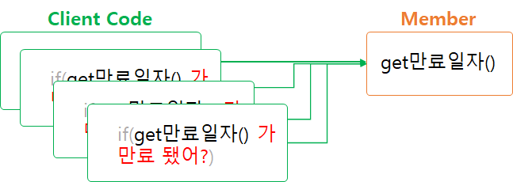

# 캡슐화

## 들어가기 앞서..

우리가 보통 Java 언어를 학습할 때 객체 지향 프로그래밍의 특징 4가지를 언급한다.

캡슐화, 추상화, 상속, 다형성.

그 중 캡슐화는 흔히 정보 은닉 이라고 배웠던 것 같다. 예전 학부 시절에 Java 강의의 시험으로 빈칸을 채우는 주관식 문제가 있었는데, 캡슐화의 특징으로 괄호를 채우는 문제였던 것으로 기억한다.

그 답은 `정보 은닉`이였다. 말그대로 정보를 감춘다 라는 뜻인데…

기존 캡슐화는 정보은닉 그리고 접근 제어자를 통한 클라이언트 코드가 몰라도 되는 정보를 감추는 수준 정도로만 이해했던 것 같다. 꽤 많은 사람들이 캡슐화에 대한 이해 수준을 이정도로 갖고 있지 않을까? 라고 생각을 하는데.. 물론 내가 이해하는 수준이 부족할 수도 있다고는 생각한다.

 최근 객체 지향 언어 및 디자인 패턴과 관련된 저서(`개발자가 반드시 정복해야할 객체 지향과 디자인 패턴 저자: 최범균`)를 읽게되면서 이 캡슐화를 다시 생각해보게 되었다.

따라서 본 내용은 해당 저서의 내용을 다루기 때문에 그 점을 참고해주었으면 좋겠다..

객체 지향은 한곳의 구현 변경이 다른 곳에 변경을 가하지 않도록 해준다. 즉, `수정`을 보다 원활하게 할 수 있는데에 객체 지향 프로그래밍을 하는 이유가 있다. 이 캡슐화는 수정을 하였을 때, 영향을 미치는 대상들을 최소화할 수 있도록 한다.

내부적인 기능의 동작이 어떻게 구현되어있는지는 감추고(정보은닉) 그 기능을 사용하는 클라이언트 코드에서는 영향을 받지 않도록하는데에 있다. 즉, 내부적인 기능 동작이 변경되더라도, 실제 기능을 사용하는 입장에서는 영향이 없다는 뜻이다.

## 캡슐화의 예시

예시를 한번 들어보자.(이 예시는 책에있는 예시를 그대로 사용..) 회원의 계정 만료일자에 따라 서비스를 제공하거나 만료되었음을 알리는 페이지로 접근하도록 처리해야한다. 이를 절차 지향적으로 처리한다면,

```java
public class Member{
	private String name;
	private Date expiryDate;
	private boolean male;

	public Date getExpiryDate(){
		return expiryDate;
	}
}
```

과 같이 표현될 것이다.

그리고 이 Member 클래스를 사용하는 클라이언트 코드에서

```java
if(member.getExpiryDate().getDate()<System.currentTeimeMillis()){
	// 만료 처리
}
```

와 같이 작성할 것이다.

물론 이렇게 멤버의 만료 여부를 확인하는 로직은 여러군데에서 쓰인다고 가정한다.

그런데 만약에, 여성인 경우에는 만료일자가 지나도 30일까지는 유예기간을 준다는 추가 요구사항이 나와 개발한다고하면, 이 만료 처리 로직을 구현한 모든 클라이언트 코드를 수정해야한다. 몇개 안되면 상관없겠지만, 많으면 많을수록 반복적인 처리를 해야한다. 그러다보면 한 두개정도 놓칠 수도 있고, 로직의 정합성에 문제가 발생하여, 실제 기능동작에 크리티컬한 문제를 야기할 수 있다. 이처럼 데이터 중심적인 사고로 프로그래밍을 하다보면, 이러한 부분을 놓히기 쉽다. 객체 관점에서 생각하도록 노력해야한다!

그러면 이를 `캡슐화`하면 어떨까?

객체 지향 프로그래밍에서 말하는 이 정보은닉은 이러한 부분을 은닉하고 수정이 일어날지라도 실제 사용하는 클라이언트 코드에서는 영향이 없게끔 하는 것이다.

캡슐화를 적용한 Member 클래스를 보도록하자.

```java
public class Member{
	private String name;
	private Date expiryDate;
	private boolean male;

	public boolean isExpired(){
		return member.getExpiryDate().getDate()<System.currentTeimeMillis();
	}
}
```

클라이언트 코드에서는 이제 이 만료 처리에대한 요구사항이 변경되더라도, isExpired 메서드만 호출하면 된다. 수정이 필요한 내용은 isExpired 내에서만 처리하면된다.

## 캡슐화를 위한 사고방식

책에서는 캡슐화에 적응할 수 있도록 하는 규칙으로 2가지를 제시하고있다.

- Tell, Don’t Ask(TDA 원칙)
- 디메테르의 법칙(Law Of Demeter);디메터, 디미터, 디메테르, 데미테르 부르는게 가지각색..

### Tell, Don’t Ask(TDA 원칙)

첫번째 이 `Tell, Don’t Ask`를 직역하면  “묻지마! 그냥 실행해!” 라는 것이다. 즉, `객체에 데이터를 요청하는게 아니라 객체가 행위를 하도록 시키는 것`이다. 클라이언트 코드 입장에서 객체의 데이터 요청이 많아져버리면, 객체의 데이터를 가지고 추가적인 조작 즉, 핸들링을 해야하고 그 과정이 중복될 수 있으며, 복잡도가 올라갈 수 있다.

무슨말이냐면, 위의 예시에서 처럼 Member에게 데이터를 요청해서 가공하고 원하는 형태로 만들고 하는 행위가 코드의 복잡도를 높힐 수 있다는 말이다.



데이터 중심의 프로그래밍


객체 중심의 프로그래밍

이로써, 코드의 중복성도 줄었고, 유지보수 시 발생할 수도 있는 문제도 캡슐화로 해결할 수 있게 되었다.

### 디메테르의 법칙(Law Of Demeter)

다음은 디메테르의 법칙이다. Demeter라는 프로젝트를 진행하던 개발자들이 어떤 객체가 사용하고있는 특정 객체에 대해서 너무 많은 정보를 알고있다보니 결합도가 높아져 좋지 못한 설계 방향으로 진행되었다. 그래서, 특정 객체에 대해 너무 많은 정보를 알게하는 대신, 메서드를 공개하는 방법으로 바꾸었는데, 이 방법을 디메테르의 법칙 이라고 이름을 짓게 되었다.

그래서 Don’t Talk to Strangers(낯선 이에게 말하지 마라) 또는 Principle of least knowledge(최소 지식 원칙) 이라고도 부른다.

앞서 지속적으로 언급한 바와 같이, 객체가 갖는 데이터 중심이 아니라 객체가 갖는 행위에 집중하여 객체 지향적으로 프로그래밍 해야한다.

이 디메테르의 법칙은 결합도가 낮도록 설계하라는 목적을 갖는 법칙이다. 즉, 모듈과 모듈사이의 결합도를 낮추기 위해,

- 객체 자기 자신의 메서드
- 메서드의 매개변수로 넘어온 인자의 메서드
- 메서드 내부에서 생성된 객체의 메서드
- 메서드가 포함한 객체의 메서드

만 호출하라는 것이다.

가령, 우리가 일반적으로 작성되는 코드에서 이러한 경우들이 더러 있다.

```java
public classs Team{
	private String name;
	private List<Member> members;
	private Date createdAt;

	public List<User> getMembers(){
		return users;
	}
}
```

```java
Team team = teamService.getTeam("불사조");
team.getMembers.size();
```

이 Team이라는 객체의 목적은 팀에 대한 정보 제공에 목적이 있다. 그런데 이 객체를 사용하는 객체의 입장에서 Team에서 Users라는 유저 정보를 노출하다보니 Team에서 User 객체의 정보까지 추가적으로 타고 들어가 User의 정보까지 낱낱이 제공하게 되었다.

이런 경우에는 Team으로 하여금, 이 객체를 사용하는 클라이언트 코드는 User와의 의존성도 갖게 되어 높은 결합도를 갖게 된다.

위의 경우에는 디메테르의 법칙을 위반한 경우라고 볼 수 있다.

그래, 만약에 Team이 팀원 수까지 같이 출력해주는 행위는 갖어야한다면 그럼 어떻게 해야할까?

```java
public classs Team{
	private String name;
	private List<Member> members;
	private Date createdAt;

	public int getCountOfMembers(){
		return users.size();
	}
}
```

자, 이처럼 위의 예시는 어떠한가? 클라이언트 코드 입장에서는 getCountOfMembers 메서드를 호출하여 멤버수를 얻어낼 수 있다. 저렇게 바꿔서 제공하니, 클라이언트 코드에서 더이상 Member에 의존하지 않아도 된다.

이 디메테르 법칙이 말하고 싶은 바는 이런 것이다. 나는 멤버수만 알면 되는데 Team 클래스가 멤버 자체를 노출시켜버리니 멤버를 타고 다른 정보도 노출해버렸는데, 아예 멤버 객체에 대해 은닉하고 멤버 수만 출력하는 행위(메서드)를 제공해줬다.

위키피디아에 기재되어있는 디메테르 법칙을 살펴보면 1 라인에 dot(.)을 하나만 쓰라고 말한다.

>💡 In particular, an object should avoid invoking methods of an object returned by another method. For many modern object oriented languages that use a dot as field identifier, the law can be stated simply as "use only one dot". That is, the code `a.m().n()` breaks the law where `a.m()` does not. As an [analogy](https://en.wikipedia.org/wiki/Analogy), when one wants a dog to walk, one does not command the dog's legs to walk directly; instead one commands the dog which then commands its own legs.
>
> [https://en.wikipedia.org/wiki/Law_of_Demeter](https://en.wikipedia.org/wiki/Law_of_Demeter)


연쇄적으로 객체에 접근하지 말라는 말을 하고싶은 것이다.

여태 생각해왔던 정보 은닉과 지금 위에서 언급해왔던 정보은닉이 본인이 생각해온 정보 은닉인가? 물론 접근제어자를 통해, 데이터에 대한 직접 접근. 그리고 공개하지 않아도되는 내부적인 로직을 감추는 행위도 맞는 표현이다. 캡슐화는 그런 것이니깐. 그런데 위의 내용을 살펴보면 조금더 생각이 확장될 수 있지 않을까?

---

상태와 행동을 하나의 객체 안에 모은느 이유는 객체의 내부 구현을 외부로부터 감추기 위해서다.

여기서 구현이란 나중에 변경될 가능성이 높은 어떤 것을 가리킨다.

객체지향이 강력한 이유는 한 곳에서 일어난 변경이 전체 시스템에 영향을 끼치지 않도록 파급효과를 적절하게 조절할 수 있는 장치를 제공하기 때문이다.

변경될 가능성이 높은 부분을 구현이라고 부르고 상대적으로 안정적인 부분을 인터페이스라고 부른다.

### 캡슐화의 진정한 의미
캡슐화는 변경될 수 있는 어떤 것이라도 감추는 것을 의미한다. 내부 속성을 외부로부터 감추는 것은 '데이터 캡슐화'라고 불리는 캐슐화의 한 종류일 뿐이다.

다시 한번 강조하지만 캡슐화란 변할 수 있는 어떤 것이라도 감추는 것이다. 그것이 속성의 타입이건, 할인 정책의 종류건 상관없이 내부 구현의 변경으로 인해 외부의 객체가 영향을 받는다면 캡슐화를 위반한 것이다.
설계에서 변하는 것이 무엇인지 고려하고 변하는 개념을 캡슐화해야 한다.[GOF94] 이것이 캡슐화라는 용어를 통해 말하고자 하는 진정한 의미다.

정리하면 캡슐화란 변하는 어떤 것이든 감추는 것이다[Bain08, Shalloway01]. 그것이 무엇이든 구현과 관련된 것이라면 말이다.