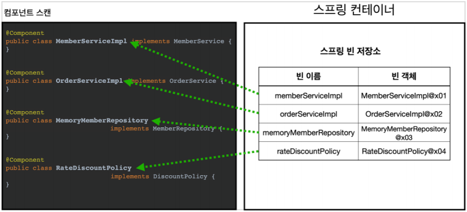

# 컴포넌트 스캔

## 컴포넌트 스캔과 의존관계 자동 주입 시작하기

- 지금까지 스프링 빈을 등록할 때는 자바 코드의 @Bean이나 XML의 <bean> 등을 통해서 설정 정보에 직접 등록할 스프링 빈을 나열했다.
- 예제에서는 몇개가 안되었지만, 이렇게 등록해야 할 스프링 빈이 수십, 수백개가 되면 일일이 등록하기 귀찮고, 설정 정보도 커지고, 누락하는 문제도 발생한다.
- 그래서 스프링은 설정 정보가 없어도 자동으로 스프링 빈을 등록하는 컴포넌트 스캔이라는 기능을 제공한다.
- 또 의존관계도 자동으로 주입하는 `@Autowired` 를 제공한다.

```java
package com.smalldogg.springcoreinflearn;

import org.springframework.context.annotation.ComponentScan;
import org.springframework.context.annotation.Configuration;
import org.springframework.context.annotation.FilterType;

@Configuration
@ComponentScan(
    excludeFilters = @ComponentScan.Filter(type = FilterType.ANNOTATION, classes = Configuration.class)
)
public class AutoAppConfig {

}
```

컴포넌트 스캔을 사용하려면 먼저 `@ComponentScan`을 설정 정보에 붙여주면 된다.

기존의 Appconfig와는 다르게 @Bean으로 등록한 클래스가 하나도 없다!

<aside>
💡

</aside>




