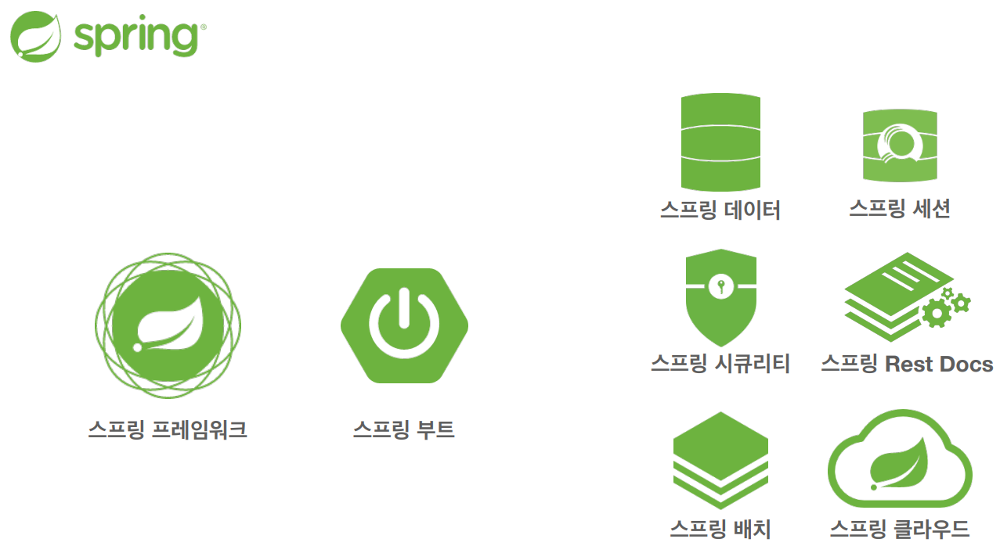

# 스프링 핵심원리

본 페이지는 김영한 님의 **스프링 핵심 원리 - 기본편** 을 토대로 작성된 내용입니다.

**목차**

# 1. 객체 지향 설계와 스프링

## 이야기 - 자바 진영의 추운 겨울과 스프링의 탄생

2000년대 초반 자바 진영에 EJB(Enterprise Java Beans)라는 표준 기술이 존재했었는데요. 스프링이나 JPA가 합쳐진 그런 엄청 큰 기술이였습니다. 그런데 EJB를 사용하려면 굉장히 어렵고 무거워서 실제 운영 환경에서 EJB 기반의 프로젝트를 구동하는데도 어려움이 많았다고 합니다. 기술은 너무 좋았지만, 너무 복잡하고 어려운데 너무 느렸으며 너무 비싸다 보니 자바 개발자들이 EJB 사용을 꺼려하게 됐다고 합니다. 그래서 순수한 자바로 돌아가자! 라는 의견이 나오면서 POJO(Plain Old Java Object) 라는 단어가 나오게 됩니다.

EJB에 진절머리가 난 두 명의 개발자 중 한 명인 *로드 존슨*은 EJB보다 훨씬 단순하면서 좋은 방법으로 개발할 수 있도록 2002년 “expert one-on-one J2EE Design and Development”라는 책을 출간하게 됩니다. 이 책이 Spring의 시작입니다. 유겐 휠러와 얀 카로프가 로드 존슨에게 새로운 시작이라는 뜻으로 **Spring**을 ****개발하기 시작합니다. 그리고 또 다른 개발자 개빈 킹은 Hibernate라는 ORM 기술을 개발하게 됩니다.

추운 겨울 EJB에서 따뜻한 봄 Spring으로 자바 진영의 표준 기술이 탄생하게 됩니다.

---

## 스프링이란?

스프링은 여러 기술들의 모음입니다.

스프링의 중심이 되는 스프링 프레임워크. 그리고 여러 기술들을 사용하기 편리하게 만든 스프링 부트 등 여러 프로젝트를 진행하고 있습니다.

**스프링 프레임워크의 핵심기술**

- 핵심 기술: 스프링 DI 컨테이너, AOP, 이벤트, 기타
- 웹 기술: 스프링 MVC, 스프링 WebFlux
- 데이터 접근 기술: 트랜잭션, JDBC, ORM 지원, XML 지원
- 기술 통합: 캐시, 이메일, 원격 접근, 스케줄링
- 테스트: 스프링 기반 테스트 지원
- 언어: 코틀린, 그루비
- 최근에는 스프링 부트를 통해서 스프링 프레임워크의 기술들을 편리하게 사용

**스프링 부트**

- 스프링을 편리하게 사용할 수 있도록 지원, 최근에는 기본으로 사용
- 단독으로 실행할 수 있는 스프링 애플리케이션을 쉽게 생성
- Tomcat 같은 웹 서버를 내장하여 별도의 웹 서버를 설치하지 않아도 됨
- 손쉬운 빌드 구성을 위한 starter 종속성 제공
- 스프링과 3rd party 라이브러리 자동 구성
- 메트릭, 상태 확인, 외부 구성 같은 프로덕션 준비 기능 제공
- 관례에 의한 간결한 설정

### 스프링의 핵심

스프링은 자바 언어 기반의 프레임워크이며, 객체 지향 언어가 가진 강력한 특징을 살려내는 프레임워크입니다. 즉, 좋은 객체 지향 애플리케이션을 개발할 수 있도록 개발자를 도와주는 프레임워크 입니다.

---

## 좋은 객체 지향 프로그래밍이란?

### 객체 지향 특징

- 추상화
- 캡슐화
- 상속
- 다형성

### 객체 지향 프로그래밍

**객체들의 모임**, 객체는 메시지를 주고받고 데이터를 처리할 수 있음(**협력**)

**유연**하고 **변경**이 용이함

### 유연하고, 변경이 용이?

레고 블럭 조립

키보드, 마우스 갈아 끼우기

컴퓨터 부품 바꾸기

컴포넌트를 쉽고 유연하게 변경하면서 개발할 수 있는 방법

⇒다형성(Polymorphism)

### 다형성(Polymorphism)

다형성의 실세계 비유

운전자 - 자동차

공연 무대

키보드 , 마우스, 세상의 표준 인터페이스

정렬 알고리즘

할인 정책 로직

### 세상에서 역할과 구현의 분리

세상이 단순해지고, 유연해지며 변경도 편리해짐.

장점

- 클라이언트는 대상의 역할(인터페이스)만 알면 된다.
- 클라이언트는 구현 대상의 **내부 구조를 몰라도** 된다.
- 클라이언트는 구현 대상의 **내부 구조가 변경**되어도 영향을 받지 않는다.
- 클라이언트는 구현 **대상 자체를 변경**해도 영향을 받지 않는다.

### 자바 언어에서 역할과 구현을 분리

자바 언어의 다형성을 활용

- 역할 = 인터페이스
- 구현 = 인터페이스르 구현한 클래스, 구현 객체

객체를 설계할 때 **역할**과 **구현**을 명확히 분리

객체 설계시 역할(인터페이스)을 먼저 부여하고, 그 역할을 수행하는 구현 객체 만들기

### 객체의 협력이라는 관계부터 생각

혼자있는 객체는 없다

클라이언트: **요청**, 서버: **응답**

수 많은 객체 클라이언트와 객체 서버는 서로 협력 관계를 가진다.

### 자바 언어의 다형성

**오버라이딩**

⇒역할과 구현을 분리함으로써, 유연하고 변경에 용이하게 사용할 수 있다.

왜? 클라이언트는 역할만 알고 있으면 구현이 어떻게 변경되든 역할에게 요청할 수 있으니까.

### 스프링과 객체 지향

IoC, DI 등을 

---

# 좋은 객체 지향 설계의 5가지 원칙(SOLID)

SOLID
클린코드로 유명한 로버트 마틴이 좋은 객체 지향 설계의 5가지 원칙을 정리

### SRP 단일 책임 원칙
Single responsibility principle

한 클래스는 하나의 책임만 가져야 한다.

하나의 책임이라는 것은 모호함

- 클 수 있고, 작을 수 있음
- 문맥과 상황에 따라 다르다

중요한 기준은 변경. 변경이 있을 때 파급효과가 작으면 단일 책임 원칙을 잘 따른 것

### ~~OCP 개방-폐쇄 원칙~~
Open/closed principle

소프트웨어 요소는 **확장에는 열려**있으나 **변경에는 닫혀** 있어야 한다

다형성을 생각해보자.

인터페이스를 구현한 새로운 클래스를 하나 만들어서 새로운 기능을 구현

- 인터페이스를 구현(확장)하지만 인터페이스를 변경하지는 않음

### LSP 리스코프 치환 원칙
Liskov substitution principle

프로그램의 객체는 프로그램의 정확성을 깨뜨리지 않으면서 하위 타입의 인스턴스로 바꿀 수 있어야 한다.

자동차 인스턴스의 악셀 기능을 구현체가 구현을 했는데. A구현체는 앞으로가고 B구현체는 뒤로가면 LSP를 위반한 것이다. 즉, 느리더라도 앞으로 가게 구현을 해야한다는 것이다. 단순히 컴파일에는 성공하는 시나리오를 넘어 개발자들의 구현에 대한 원칙적인 부분을 의미하는 것이다.

### ISP 인터페이스 분리 원칙
Interface segregation principle

특정 클라이언트를 위한 인터페이스 여러 개가 범용 인터페이스 하나보다 낫다

자동차 인터페이스 → 운전 인터페이스, 정비 인터페이스로 분리

사용자 클라이언트 → 운전자 클라이언트, 정비사 클라이언트로 분리

분리하면 정비 인터페이스 자체가 변경되어도 운전자 클라이언트에게 영향을 주지 않음

인터페이스가 명확해지고, 대체 가능성이 높아짐

### ~~DIP 의존관계 역전 원칙~~
Dependency inversion principle

프로그래머는 “추상화에 의존해야지, 구체화에 의존하면 안된다.” 의존성 주입은 이 원칙을 따르는 방법 중 하나다.

쉽게 이야기해서 구현 클래스에 의존하지 말고, 인터페이스에 의존하라는 뜻

클라이언트 코드가 구현체 클래스가 아닌 인터페이스 클래스만 바라봐라....

**역할에 의존하게 해야한다**는 뜻.

---

## 객체 지향 설계와 스프링

### 다시 스프링으로

스프링은 다음 기술로 다형성 + OCP, DIP를 가능하게 지원

- DI(Dependency Injection): 의존관계, 의존성 주입
- DI 컨테이너 제공

---

# 스프링 핵심 원리 이해1 - 예제 만들기

예제 레포지토리 : https://github.com/small-dogg/spring-core-inflearn

## 비즈니스 요구사항과 설계

회원

- 회원을 **가입**하고 **조회**할 수 있다.
- 회원은 **일반**과 **VIP** 두가지 등급이 있다.
- 회원 데이터는 **자체 DB**를 구축할 수 있고, **외부 시스템과 연동**할 수 있다.(**미확정**)

### 회원 도메인 협력 관계

### 회원 클래스 다이어그램

### 회원 객체 다이어그램

주문과 할인 정책

- 회원은 **상품을 주문**할 수 있다.
- 회원 등급에 따라 **할인 정책을 적용**할 수 있다.
- 할인 정책은 **모든 VIP**는 **1000**원을 할인해주는 고정 금액 할인을 적용해달라. (**나중에 변경될 수도 있다.**)
- 할인 정책은 변경 가능성이 높다. 회사의 기본 할인 정책을 아직 정하지 못했고, 오픈 직전까지 고민을 미루고 싶다. 최악의 경우 할인을 적용하지 않을 수도 있다. (**미확정**)

### 주문 도메인 협력, 역할, 책임

### **주문 도메인 전체**

### **주문 도메인 클래스 다이어그램**

### 주문 도메인 객체 다이어그램1

### 주문 도메인 객체 다이어그램2

---

# 스프링 핵심 원리 이해2 - 객체 지향 원리 적용

<aside>
💡 새로운 할인 정책을 확장해보자!

</aside>

참고: 애자일소프트웨어개발선언 [https://agilemanifesto.org/iso/ko/manifesto.html](https://agilemanifesto.org/iso/ko/manifesto.html)

**고정 할인 정책 → 정률 할인 정책**

할인 정책을 정률 학인 정책으로 변경하려면, `OrderserviceImpl`의 코드를 수정해야 한다.

**문제점**

OCP, DIP 같은 객체 지향 설계 원칙을 준수하지 못함.

DIP : 추상(인터페이스)뿐만 아니라 구체(구현) 클래스에도 의존하고 있음

위의 그림처럼 인터페이스 만을 의존하여 DIP를 준수하고자 했으나,

`FixDiscountPolicy` 또는 `RateDiscountPolicy`를 함께 의존하고 있다. 추상 및 구체에 모두 의존하였다.

**⇒ DIP 위반**

**정책변경**

`FixDiscountPolicy`에서 `RateDiscountPolicy`로 변경하면, `OrderServiceImpl`도 변경해야한다.

즉, 기능을 확장해서 변경을 하면, 클라이언트 코드에 영향을 준다.

**⇒ OCP 위반**

**어떻게 문제를 해결할 수 있을까?**

DIP 위반 → 추상에만 의존하도록 변경(인터페이스에만 의존)

변경하였지만 구체가 존재하지 않아 `discountPolicy`의 메서드를 호출하는 과정에서 NPE가 발생한다.

**해결방안**

누군가 클라이언트인 ‘`OrderserviceImpl`’에 ‘`DiscountPolicy`'의 구현 객체를 대신 주입해주면 된다.

---

## **관심사의 분리**

누군가의 클라이언트에 해당하는 대상은 어떠한 인터페이스의 작업만을 호출한다. 즉 예시로 `MemberServiceImpl` 이 `MemberRepository` 를 통해서, Member를 저장하거나 조회하면 된다. 그  

`MemberRepository`가 `MemoryMemberRepository` 인지, `DBMemberRepository` 인지에 대한 구현체를 알 필요는 없다. 이를 **관심사 분리**라고 한다. 관심사를 분리하기 위해서는 실제 구현체를 주입해줄 수 있는 즉, `MemberserviceImpl` 이 `MemberRepository`를 호출하였을 때, 어떠한 Repository를 사용해줄 것 인지에 대한 대상을 주입해줘야 한다.

의존관계에 대한 주입을 외부(`AppConfig`)에서 수행하여, 관심사를 명확히 분리해준다.

객체의 생성과 연결은 `AppConfig` 가 담당한다.

객체를 생성하고 연결하는 역할과 실행하는 역할이 명확히 분리되었다.

**회원 객체 인스턴스 다이어그램**

`appConfig` 객체는 `memoryMemberRepository` 객체를 생성하고 그 참조값을 `memberServiceImpl` 을 생성하면서 생성자로 전달한다.

클라이언트인 `memberServiceImpl` 입장에서 보면 의존관계를 마치 외부에서 주입해주는 것 같다고 해서 DI(Depedency Injection) 우리말로 **의존관계 주입** 또는 **의존성 주입**이라고 한다.

---

### AppConfig 리팩터링

현재 AppConfig를 보면 ‘중복’이 있고, **역할**에 따른 **구현**이 잘 안보인다.

---

### 새로운 구조와 할인 정책 적용

AppConfig의 등장으로 애플리케이션이 크게 사용 영역과, 객체를 생성하고 구성하는 영역으로 분리되었다.

**사용, 구성의 분리**

**할인 정책의 변경**

구성 영역만 변경하여 실 사용 영역의 내용이 변경되지 않을 상태로 할인 정책을 변경할 수 있다.

---

## 좋은 객체 지향 설계의 5가지 원칙의 적용

위의 예제에서는 SRP, DIP, OCP를 적용

SRP 단일 책임 원칙

한 클래스는 하나의 책임만 가져야 한다.

클라이언트 객체는 직접 구현 객체를 생성하고, 연결하고, 실행하는 다양한 책임을 가지고 있었음 → SRP 위반

SRP 단일 책임 원칙을 따르기 위해 관심사를 분리함

구현 객체를 생성하고 연결하는 책임을 AppConfig가 담당하도록 관심사가 분리됨

클라이언트 객체는 실행하는 책임만 담당하게 됨

DIP 의존관계 역전 원칙

프로그래머는 “추상화에 의존해야지, 구체화에 의존하면 안된다.” 의존성 주입은 이 원칙을 따르는 방법 중 하나다.

새로운 할인 정책(구현)을 개발하고, 이를 사용하려고 하니 클라이언트 코드도 함께 변경해야 했다. 왜냐하면 기존 클라이언트 코드는 DIP를 지키며 `DiscountPolicy` 추상화 인터페이스에 의존하는 것 같았지만, `FixDiscountPolicy` 에 해당하는 구현체도 함께 의존했기 때문이다.

클라이언트 코드가 `DiscountPolicy` 추상화 인터페이스에만 의존하도록 코드를 변경했다.

하지만 클라이언트 코드는 인터페이스만으로는 아무것도 실행할 수 없다.

`AppConfig` 가 `FixDiscountPolicy` 객체 인스턴스를 클라이언트 코드 대신 생성해서 클라이언트 코드에 의존관계를 주입하였다. 이로써 DIP 원칙을 따르면서 문제도 해결되었다.

OCP 개방 폐쇄 원칙

소프트웨어 요소는 확장에는 열려 있으나 변경에는 닫혀 있어야 한다

다형성을 사용하고 클라이언트가 DIP를 지키면 OCP를 지킬 수 있는 가능성이 열림

애플리케이션을 사용 영역과 구성 영역으로 나눔

`AppConfig`가 의존관계를 `FixDiscountPolicy` 에서 `RateDiscountPolicy` 로 변경해서 클라이언트 코드에 주입하므로 클라이언트 코드는 변경하지 않아도 됨

소프트웨어 요소를 **새롭게** **확장**해도 사용 영역의 **변경은 닫혀** 있다.

---

## IoC, DI, 그리고 컨테이너

**제어의 역전 IoC(Inversion of Control)**

기존 프로그램은 클라이언트 코드에서 프로그램의 흐름을 직접 제어하였다. 하지만 AppConfig를 사용하면서 AppConfig가 프로그램의 흐름을 제어하고 실제 클라이언트 코드는 실행의 역할만을 수행하게 되었다. IoC에서 말하는 Control(제어)은 프로그램의 흐름을 제어함을 의미한다. 즉 다시 말해, 기존에 익숙한 흐름인 클라이언트 코드에서 인터페이스의 구현체를 직접 호출하는 형태가 아닌 클라이언트 코드는 어떠한 구현체를 사용할지는 알지 못하고 인터페이스만을 호출하게 된다. 프로그램의 흐름이 어떻게 흘러가는지 클라이언트 코드에서는 알 수가 없다. 왜냐하면 AppConfig가 프로그램의 흐름을 제어하기 때문에.. 이를 제어의 역전이라고 한다.

**의존관계 주입 DI(Dependency Injection)**

OrderServiceImpl 은 DiscountPolicy 인터페이스에만 의존한다. 실제 어떤 구현 객체가 사용될지는 모른다.

**정적인 클래스 의존관계**

클래스가 사용하는 import 코드만 보고 의존관계를 쉽게 판단할 수 있다. 정적인 의존관계는 애플리케이션을 실행하지 않아도 분석할 수 있다.

**동적인 객체 인스턴스 의존 관계**

애플리케이션 실행 시점에 실제 생성된 객체 인스턴스의 참조가 연결된 의존 관계이다.

**스프링 컨테이너**

- `ApplicationContext` 를 스프링 컨테이너라 한다.
- 기존 개발자가 `AppConfig` 를 사용하여 직접 객체를 생성하고 DI를 했지만, 이제부터는 스프링 컨테이너를 통해서 사용한다.
- 스프링 컨테이너는 `@Configuration` 이 붙은 `AppConfig` 를 설정 정보로 사용한다. 여기서 `@Bean` 이라 적힌 메서드를 모두 호출한다. 이렇게 스프링 컨테이너에 등록된 객체를 스프링 빈이라 한다.
- 스프링 빈은 `@Bean` 이 붙은 **메서드 명**을 스프링 빈의 이름으로 사용한다.
- 이러한 스프링 빈은 `applicationContext.getBean(”빈이름”)` 메서드로 사용할 수 있다.
- 기존에는 개발자가 직접 자바코드로 모든 것을 했다면 이제부터는 스프링 컨테이너에 객체를 스프링 빈으로 등록하고, 스프링 컨테이너에서 스프링 빈을 찾아서 사용하도록 변경되었다.

---

# 스프링 컨테이너와 스프링 빈

## 스프링 컨테이너 생성

스프링 컨테이너가 생성되는 과정을 알아보자.

- `ApplicationContext` 를 스프링 컨테이너라 한다.
- `ApplicationContext` 는 인터페이스이다.
- 스프링 컨테이너는 XML을 기반으로 만들 수 있고, 애노테이션 기반의 자바 설정 클래스로 만들 수 있다.
- 직전에 `AppConfig` 를 사용했던 방식이 애노테이션 기반의 자바 설정 클래스로 스프링 컨테이너를 만든 것이다.
- 자바 설정 클래스를 기반으로 스프링 컨테이너(`ApplicationContext`)를 만들어보자.
    - `new AnnotationConfigApplicationContext(AppConfig.class);`
    - 이 클래스는 `ApplicationContext` 인터페이스의 구현체이다.
    

<aside>
💡 참고: 더 정확히는 스프링 컨테이너를 부를 때 `BeanFactory` , `ApplicationContext` 로 구분해서 이야기한다. 이 부분은 뒤에서 설명한다. `BeanFactory` 를 직접 사용하는 경우는 거의 없으므로 일반적으로 `ApplicationContext` 를 스프링 컨테이너라 한다.

</aside>

### 1. 스프링 컨테이너의 생성 과정

`new AnnotationConfigApplciationContext(AppConfig.class);`

스프링 컨테이너를 생성할 때는 구성 정보를 지정해주어야 한다.

여기서는 `AppConfig.Class` 를 구성 정보로 지정했다.

### 2. 스프링 빈 등록

스프링 컨테이너는 파라미터로 넘어온 설정 클래스 정보를 사용하여 스프링 빈을 등록한다.

**빈 이름**

빈 이름은 메서드 이름을 사용한다.

빈 이름은 직접 부여할 수도 있다.

`@Bean(name=”memberService2”)`

주의 : 빈 이름은 항상 다름 이름을 부여해야하고 중복되어서는 안된다.

### 3. 스프링 빈 의존관계 설정 - 준비

### 4. 스프링 빈 의존관계 설정 - 완료

- 스프링 컨테이너는 설정 정보를 참고해서 의존관계를 주입(DI)한다.
- 단순히 자바 코드를 호출하는 것 같지만, 차이가 있다. 이 차이는 뒤에 싱글톤 컨테이너에서 설명한다.

**참고**

스프링은 빈을 생성하고, 의존관계를 주입하는 단계가 나누어져 있다. 그런데 자바 코드로 스프링 빈을 등록하면 생성자를 호출하면서 의존관계 주입도 한번에 처리된다. 여기서는 이해를 돕기 위해 개념적으로 나누어 설명했다. 자세한 내용은 의존관계 자동 주입에서 다시 설명하겠다.

**정리**

스프링 컨테이너를 생성하고, 설정(구성) 정보를 참고해서 스프링 빈도 등록하고, 의존관계도 설정했다.

이제 스프링 컨테이너에서 데이터를 조회해보자.

---

## 스프링 빈 조회 - 상속관계

- 부모 타입으로 조회하면, 자식 타입도 함께 조회한다.
- 그래서 모든 자바 객체의 최고 부모인 `Object` 타입으로 조회하면, 모든 스프링 빈을 조회한다.

