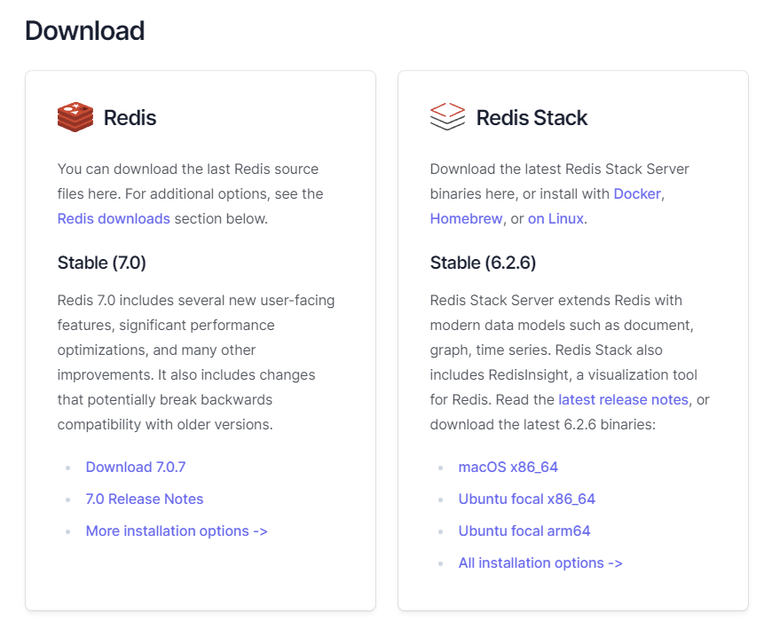
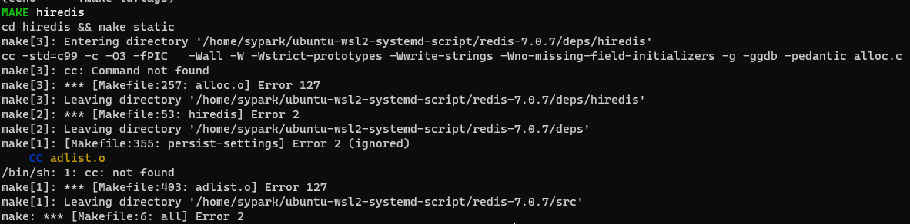
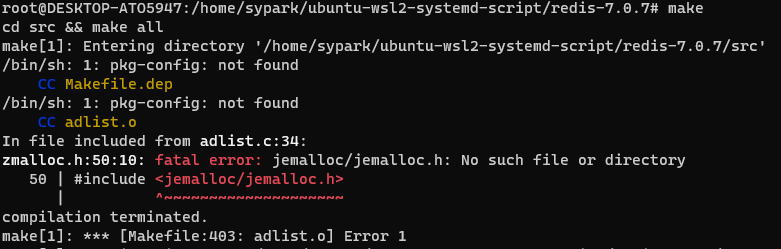
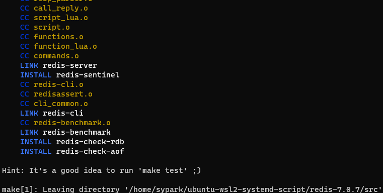
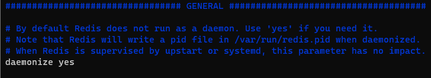

## Redis 최신버전 설치

> 본 포스팅은 Ubuntu 환경에 Redis를 최신버전으로 설치하는 내용을 담고있다.

### 설치하기

1. [Redis 설치 페이지](https://redis.io/download/)로 이동한다.



2. 좌측 하단 Download 7.0.7(포스팅 작성 기준) 우측버튼을 눌러 주소를 복사하여, URL을 복사한다.

3. Ubuntu 환경에서 wget 명령을 통해, 해당 파일을 다운로드 받는다.

```shell
wget https://github.com/redis/redis/archive/7.0.7.tar.gz
```

4. 다운로드 받은 gzip 파일의 압축을 해제한다.

```shell
tar zxvf 7.0.7.tar.gz
```

5. 압축해제한 디렉터리로 이동한다.

```shell
cd redis-7.0.7
```

6. make 커맨드를 사용하여, 프로그램 빌드 컴파일을 수행한다.

```shell
make
```

> make 명령을 수행하기 위해서는 빌드 컴파일 대상마다 요구하는 추가 패키지가 존재할 수 있다.
> 
> 대표적으로는 gcc g++ 등이 있다.
> 
> apt install make
> apt-get install gcc g++
> 
> 컴파일 과정에서 커맨드가 수행되지 않는 경우에는 error 메시지를 통해 부가적으로 설치 하거나 구성해야되는 정보를 직접 파악해야한다.
> 
> 아래 이미지들은 make 명령 수행과정에서 실패에 따라 추가 설치된 패키지에 대한 정보이다.

- gcc g++ 설치



- redis 의존성 설치



압축해제한 디렉터레 내에 deps(의존성) 디렉터리가 존재한다.
해당 디렉터리로 이동하여 아래 명령을 수행한다.
```shell
make hiredis jemalloc linenoise lua hdr_histogram
```



### redis-server를 보다 쉽게 실행하기 위한, 데모나이즈 구성 및 system 데몬 등록

1. 컴파일이 완료되었다면, 해당 디렉토리 내 존재하는 redis 설정파일인 `redis.conf` 파일을 vi 편집기로 연다.

```shell
vim /home/sypark/redis-7.0.7/redis.conf
```

2. 아래 위치에 존재하는 daemonize 설정값을 yes로 변경한다.



3. systemd 내 데몬을 등록하자. 일반적으로 데몬을 등록하는 위치인 `/etc/systemd/system`디렉터리에 아래 파일을 작성하고 열자.

```shell
vim /etc/systemd/system/redis.service 
```

4. 아래와같이 유닛 및 서비스 정보를 등록하고 저장하자.

> 여기서 유저,그룹 및 redis 디렉터리 위치는 작성자 마다 다를 수 있다. 본인 환경에 유의하자.

```shell
[Unit]
Description=Redis In-Memory Data Store
After=network.target

[Service]
User=root
Group=root
ExecStart=/home/sypark/redis-7.0.7/src/redis-server /home/ubuntu/ryan/redis-6.2.5/redis.conf
ExecStop=/home/sypark/redis-7.0.7/src/redis-cli shutdown
Restart=always

[Install]
WantedBy=multi-user.target
```

시스템 데몬 작성을 완료하였다. 이번엔 등록 후 실행을 해보자.

```shell
systemctl enable redis.service
systemctl daemon-reload
systemctl start redis.service
```