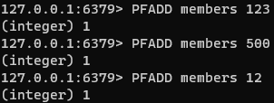
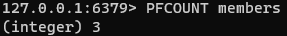
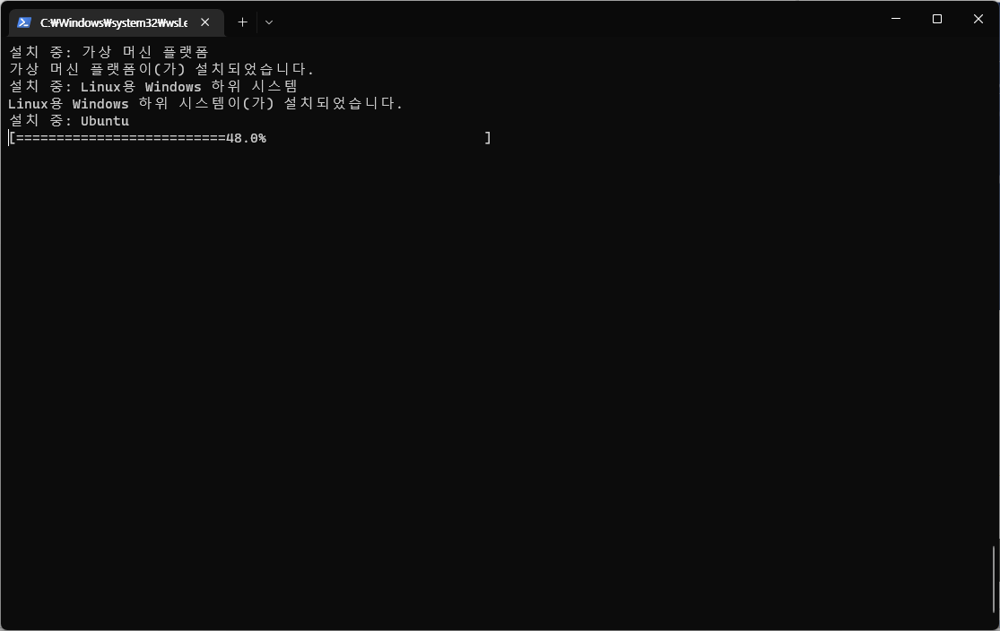
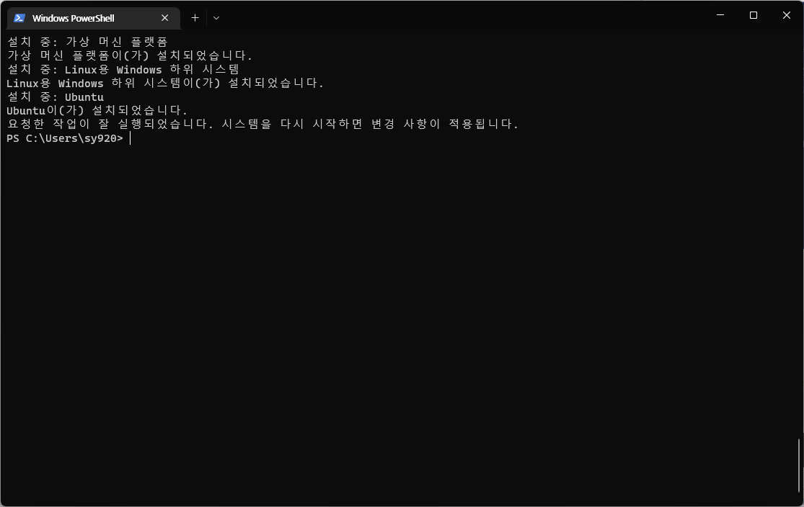
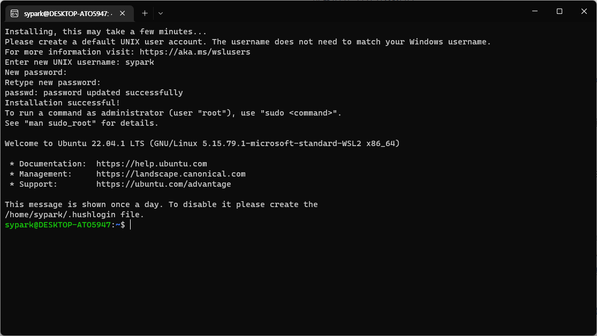
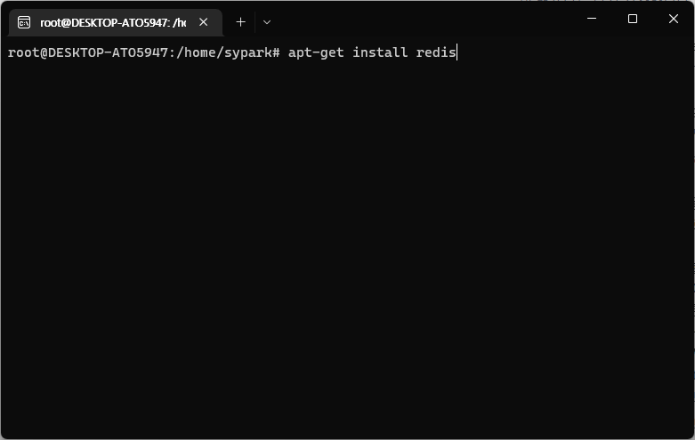
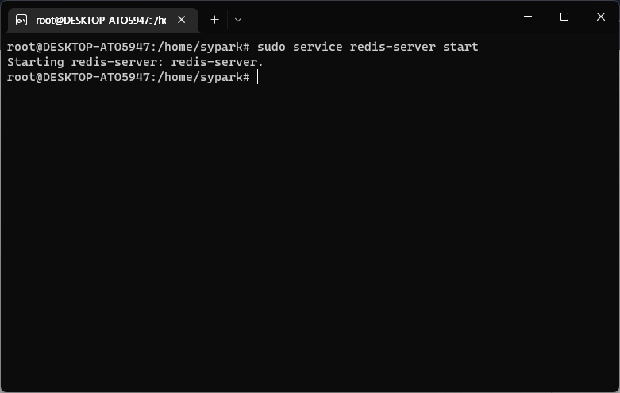
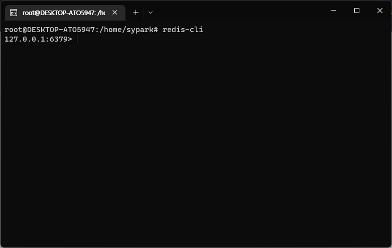

# Redis 개요 및 설치

## Redis 란?
Redis는 오픈소스 기반의 인메모리 데이터 저장소이다. 수 많은 개발자들이 데이터베이스, 캐시, 스트리밍 엔진, 메시지 브로커로 사용한다.

## Redis 시작하기
이 포스팅은 Redis 공식 문서를 기반으로 작성되었다. 아래의 절차를 따르면, Redis를 설치하고 간략히 사용하는 방법까지 이해할 수 있다.

### 1. Redis 설치
Redis 공식 문서에서는 OS 별로 설치 방법을 다룬다. 필자는 Windows 기반의 Redis 설치를 다루겠다.
- [소스에서 Redis 설치](https://redis.io/docs/getting-started/installation/install-redis-from-source)
- [Linux에서 Redis 설치](https://redis.io/docs/getting-started/installation/install-redis-on-linux)
- [macOS에서 Redis 설치](https://redis.io/docs/getting-started/installation/install-redis-on-mac-os)
- [Windows에서 Redis 설치](https://redis.io/docs/getting-started/installation/install-redis-on-windows)

먼저, Redis는 공식적으로 Windows OS를 지원하지 않는다. 따라서 WSL2와 같은 Linux용 Windows 하위 시스템을 사용해야한다.
WSL2를 사용하면 Windows에서 기본적인 Linux 바이너리를 실행할 수 있게된다.

먼저 `Windows powershell`을 실행한다.

다음은 가상머신 플랫폼을 설치한다.

그러면 다음과 같이 Linux OS 설치를 진행한다.

완료가 되면 시스템을 재시작하여 변경 사항을 적용한다.

시스템을 재시작하면 아래와 같이 창이 뜨고, 계정과 패스워드를 지정하면 설치 완료이다.

자 이젠 ubuntu 패키지 관리자 명령을 통해 Redis를 본격적으로 설치해보자.
먼저 `apt-get update` 명령을 통해 리포지토리를 업데이트 해준다.

Redis 설치 명령을 수행하고 Redis를 설치한다.

설치가 완료되면, redis-server 서비스 시작 명령을 수행한다.

Redis를 구동하면 `redis-cli`에 연결할 수 있고, 아래의 내용을 바로 진행할 수 있다.

redis-cli 명령을 수행하여, redis에 접속해보자.

