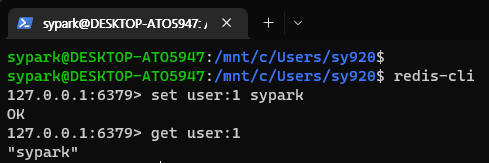
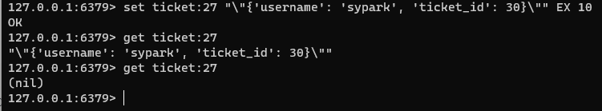
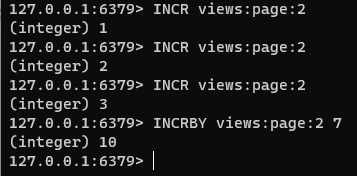

### 문자열

Redis 문자열은 텍스트, 직렬화 객체 및 이진 배열을 포함하여 바이트 시퀀스를 저장한다. 따라서 문자열은 가장 기본적인 Redis의 데이터 유형이다.

캐싱에 자주 사용되며, 카운터나 비트 연산을 수행할 수 있는 추가 기능도 있다.

#### 기본 기능

- 단순한 문자열 저장

- 직렬화된 JSON 문자열 저장 및 10초 후 만료 설정

- 카운터 증가 (INCR : 1씩 증가, INCRBY 입력된 수 만큼 증가), 부동 소수점 카운터도 존재(INCRBYFLOAT)

기본적으로 단일 Redis 문자열은 최대 512MB까지 가능합니다.

#### 기본 명령
- SET : 문자열 값을 저장합니다.
- SETNX : 키가 아직 존재하지 않는 경우에만 저장합니다.
- GET : 문자열 값을 검색합니다.
- MGET : 단일 작업에서 여러 문자열 값을 검색합니다.

#### 성능

대부분의 문자열 작업은 O(1) 의 성능으로 매우 효율적이나, SUBSTR, GETRANGE 등의 명령을 통한 연산 시 성능에 영향을 줄 수 있다.

