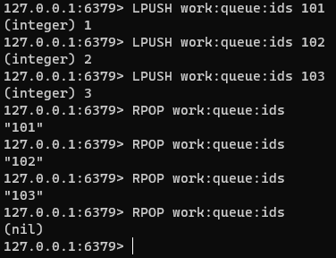
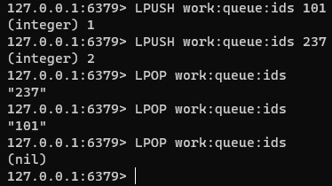
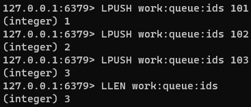
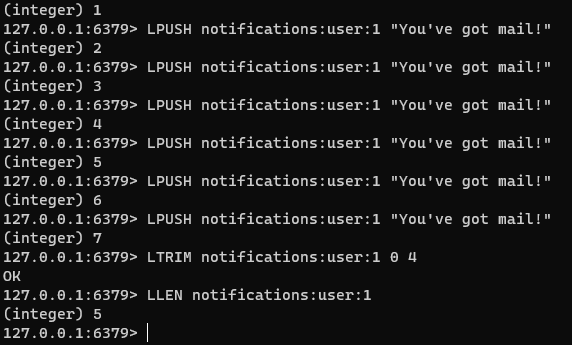

### 리스트
Redis 리스트는 문자열 값의 연결된 형태이다. 스택 및 큐를 구현할때 사용하거나, 백그라운드 작업자 시스템을 위한 대기열 관리로 사용될 수 있다.

- 큐 예시(FIFO)

- 스택 예시(LIFO)

- 길이 확인

- 리스트 TRIM으로 길이 자르기

- Redis 리스트의 최대 길이는 $2^{32}- 1$(4,294,967,295) 개 이다.

#### 기본 명령
- LPUSH : 리스트의 헤드에 새 요소를 추가
- RPUSH : 리스트의 꼬리에 새 요소 추가
- LPOP : 리스트의 헤드에서 요소 제거 및 반환
- RPOP : 리스트의 꼬리에서 요소 제거 및 반환
- LLEN : 리스트의 길이 반환
- LMOVE : 한 리스트에서 다른 리스트로 요소를 원자적으로 이동.
- LTRIM : 리스트를 지정된 요소 범위로 줄임

- BLPOP : 리스트의 헤드에서 요소를 제거하고 반환. 목록이 비어있으면 요소를 사용할 수 있게 되거나 지정된 타임아웃까지 명령이 차단됨.
- BLMOVE : SOURCE 리스트에서 DESTINATION 리스트로 요소를 원자적으로 이동함. 소스 목록이 비어있으면 새 요소를 사용할 수 있을때까지 명령이 차단됨.

#### 성능
리스트에서 헤드 또는 꼬리에 액세스하는 작업은 O(1)이다. 하지만, 리스트 내 요소를 조작하는 명령은 일반적으로 O(n)이다. 예를들어 LINDEX, LINSERT 등이 이에 포함된다.
주로 데이터 양이 많은 리스트에서 이러한 연산을 주의해야한다.

#### 대안
불확실한 일련의 이벤트를 처리해야되는 경우 리스트보단 REdis Stream을 고려하는 것이 좋다.