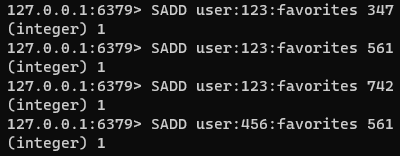
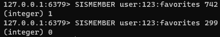
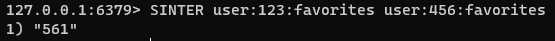
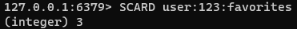

### 집합

Redis 집합은 고유한 문자열의 정렬되지 않은 모음이다. Redis 집합을 사용하면 다음과 같은 경우에 효율적으로 사용할 수 있다.
- 고유한 항목을 추적(지정된 블로그 게시물에 액세스하는 모든 고유한 IP 주소 추적)
- 관계를 나타냄(주어진 역할을 가진 모든 사용자의 집합을 나타낼 때)
- 교집합, 합집합 및 차이와 같은 일반적인 집합 연산 수행

사용자 123과 456이 즐겨찾는 책의 ID를 각 집합에 저장하고, 교집합 및 여집합 찾기

- 여집합

- 교집합

- 집합 내 원소 수

Redis 집합의 최대 크기는 $2^{32}-1$(4,294,967,295) 이다.

#### 기본 명령

- SADD : 집합 내 원소를 추가한다.
- SREM : 집합 내 입력된 원소를 제거한다.
- SISMEMBER : 집합 내 원소 존재 여부를 확인한다.
- SINTER : 두 집합 내 입력된 값을 원소로 공통적으로 갖는지의 여부를 확인한다.
- SCARD : 집합의 크기(카디널리티)를 반환한다.

#### 성능

추가, 제거 및 항목이 집합 원소인지의 여부를 확인하는 등 대부분의 작업은 O(1)의 성능을 보인다.
이것은 집합이 얼마나 효율적인지 알 수 있다. 하지만, 원소가 수십만 개 이상인 대규모 집합의 경우 SMEMBERS 명령을 수행할 떄 주의해야한다.
이 명령의 경우 O(n)이며 전체 집합을 단일 응답으로 반환하기 때문이다. 대안으로 SSCAN을 사용하여 집합의 모든 구성원을 반복적으로 검색하는 방안을 고려해야 한다.

#### 대안
대규모 데이터 집합 또는 스트리밍 데이터의 경우 집합을 사용하면 많은 메모리를 필요료할 수 있다.
메모리 사용량이 우려되며 데이터 정확성이 중요하지 않은 경우에는 Bloom 필터 또는 Cuckoo 필터를 사용할 수 있다.

[Bloom 필터 및 Cuckoo 필터](https://redis.io/docs/stack/bloom)

