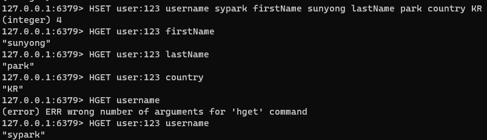
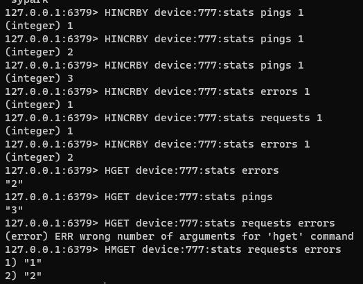

### 해시

Redis 해시는 필드-값 쌍의 컬렉션으로 구성된 레코드 유형이다.
해시를 사용하여 무엇보다도 기본 개체를 나타내거나 카운터 그룹을 저장할 수 있다.

#### 예시

- 사용자 프로필을 해시로 작성

- 특정 장치에 핑, 요청, 오류 등을 보낸 횟수에 대해 카운터를 저장

#### 기본 명령

- HSET : 해시에 하나 이상의 필드 값을 설정한다.
- HGET : 입력된 필드의 값을 반환한다.
- HMGET : 하나 이상의 입력된 필드의 값을 반환한다.
- HINCRBY : 입력된 필드의 값을 입력된 수 만큼 증가시킨다.

#### 성능

대부분의 Redis 해시 명령은 O(1)이다.

HKEYS, HVALS, HGETALL 과 같은 몇몇의 명령어는 O(n)의 성능을 보이며, 여기서 n은 필드-값 쌍의 수를 의미한다.

모든 해시는 최대 $2^{32}-1$(4,294,967,295)만큼 저장할 수 있으며, 호스팅하는 VM의 전체 메모리에 의해 제한될 수 있다.
