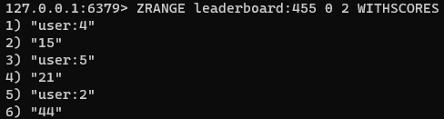

### 정렬 집합

Redis 정렬 집합은 연관된 점수(?)로 정렬된 고유한 문자열(요소) 모음이다.

둘 이상의 문자열이 동일한 점수를 갖는 경우 문자열은 사전순으로 정렬된다.

- 예를들어 대규모 온라인 게임에서 가장 높은 점수의 정렬된 목록(스코어 보드)을 쉽게 유지할 수 있다.
- 특히 정렬 집합을 사용하여 과도한 API 요청을 방지하기 위해 슬라이딩 윈도우 속도 제한기(?)를 구축할 수 있다.

#### 예시

- 실시간 플레이어 순위표

원소 추가

하위 3명의 플레이어 및 점수 확인

특정 사용자의 순위 확인

#### 기본 명령

- ZADD : 새 멤버 및 관련 점수를 추가한다. 이미 존재할 경우 점수를 업데이트한다.
- ZRANGE : 주어진 범위 내 집합의 구성원을 반환한다.
- ZRANK : 오름차순 기준 입력된 멤버의 순위를 반환한다.
- ZREVRANK : 내림차순 기준 입력된 멤버의 순위를 반환한다.

#### 성능
대부분의 연산은 O(log(n))이며, 여기서 n은 원소 수 이다.

ZRANGE를 큰 반환 값(수만 개 이상)대상으로 명령을 수행할 경우 시간 복잡도는 O(log(n)+m)이다. 여기서 m은 반환된 결과의 수이다.

#### 대안

Redis 정렬 집합은 때로 다른 REdis 데이터 구조를 인덱싱하는 목적으로 사용된다.

데이터를 인덱싱하고 쿼리해야될 경우에는 [RedisSearch](https://redis.io/docs/stack/search) 및 [RedisJSON](https://redis.io/docs/stack/json)을 고려해라.

