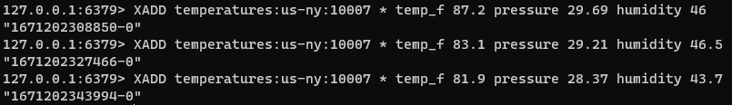
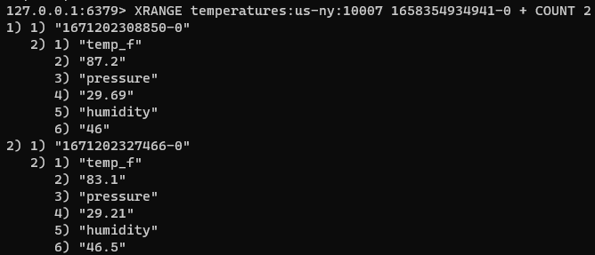
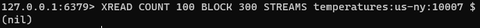

### 스트림

Redis 스트림은 추가 전용 로그처럼 작동하는 데이터 구조이다.

스트림을 사용하여 실시간으로 이벤트를 기록하고 동시에 신디케이트할 수 있다.

- 이벤트 소싱(사용자 작업, 클릭 추적 등)
- 센서 모니터링(현장 장치의 판독 값)
- 알림(각 사용자의 알림 기록을 별도의 스트림에 저장)

Redis는 각 스트림 항목에 대해 고유한 ID를 생성한다. 이러한 ID를 사용하여 후에 연결된 하옴ㄱ을 검색하거나 스트림의 모든 후속 항목을 읽고 처리할 수 있다.

Redis 스트림은 여러 트리밍 전략(스트림이 무제한으로 커지는 것을 방지)과 둘 이상의 소비 전략(XREAD, XREADGROUP 및 XRANGE)을 지원합니다.

#### 예시
- 스트림에 여러 온도 판독 값 추가

- 1658354934941-0 ID에서 시작하는 처음 두 개의 스트림 항목 읽기.

- 스트림 마지막부터 최대 100개의 새 스트림 항목을 읽고 항목이 기록되지 않는 경우 최대 300ms 동안 차단

#### 기본 명령
- XADD : 스트림에 새 항목을 추가한다.
- XREAD : 지정된 위치에서 시작하여 앞으로 이동하면서 하나 이상의 항목을 읽는다.
- XRANGE : 입력된 두 항목 ID 사이의 항목 범위를 반환한다.
- XLEN : 스트림의 길이를 반환한다.

#### 성능
스트림에 항목을 추가하는 것은 O(1)이다. 단일 항목에 핵세스 하는 것은 O(n)이며, 여기서 n은 ID 의 길이를 뜻한다.

스트림 ID는 일반적으로 짧고 길이가 고정되어 있으므로 일정한 시간 조회로 효과적으로 줄어든다.([스트림 기수 트리](https://en.wikipedia.org/wiki/Radix_tree))

Redis 스트림은 매우 효울적인 삽입 및 읽기를 제공한다.