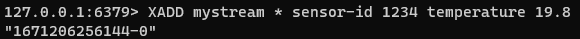
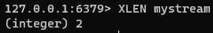
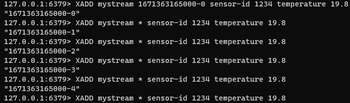
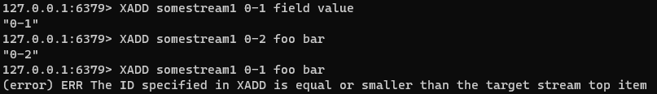
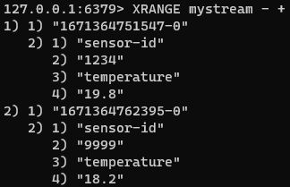
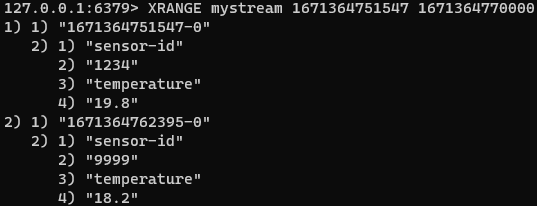
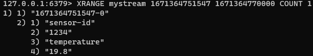
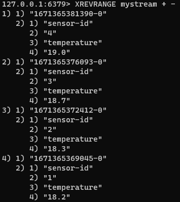
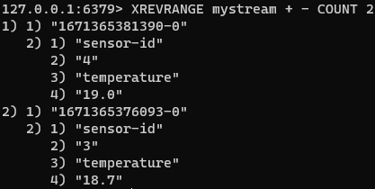
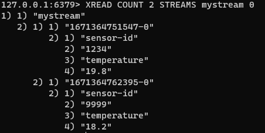

### 스트림 자습서

Redis 스트림 데이터 타입은 5.0 버전 부터 도입되었다.
Stream은 로그 데이터 타입을 모델링하지만 일반적인 Append-Only 로그의 일부 한계를 극복하기 위해 여러 작업을 구현한다.

여기에는 O(1) 시간의 임의 액세스 및 소비자 그룹과 같은 복잡한 소비 전략이 포함된다.

#### 스트림 기본 사항

스트림은 AO(Append-Only) 데이터 타입이다.

XADD 라는 기본 쓰기 명령은 지정된 스트림에 새 항목을 추가한다.

각 스트림 항목은 레코드 또는 Redis 해시와 같은 하나 이상의 필드-값으로 구성된다.



위 예시에서는 mystream이라는 키에 센서 ID 및 온도 값을 작성하였다.

첫번째 인수로는 키 이름을 작성하고, 두번째 인수는 스트림 내부의 모든 항목을 식별하는 ID를 작성한다.
위 예시에서는 서버가 새 ID를 자동 발급해주기 때문에 '*'을 기입하여 이 과정을 생략했다.

모든 새 ID는 단조롭게 증가하며, 서버에서 자동생성되는 ID는 거의 대부분 사용자가 원하는 것이고, 명시적으로 지정하는 경우는 드물다.
뒤에서 이 ID 자동생성에 대해 더 다룰 예정이다. 여기서 줄 번호 또는 파일 내부의 바이트 오프셋을 사용하여 지정된 항목을 식별할 수 있다.

예제로 돌아가서, XADD키 이름과 ID 다음에 존재하는 인수는 스트림 항목을 구성하는 필드-값 쌍이다.

XLEN 커맨드를 사용하여 다음과 같이 스트림 내 항목 수를 가져올 수 있다.



##### 항목 ID

항목 ID는 XADD 명령에 의해 반환되고, 지정된 스트림 내의 각 항목을 일관되게 식별하는 항목 ID는 다음 두 부분으로 구성된다.

```
<millisecondsTime>-<sequenceNumber>
```

앞 부분에 작성된 `millisecondsTime` 부분은 스트림 ID를 생성하는 로컬 Redis 노드의 현지 시간이지만, 현재 밀리초 시간이 이전 항목 시간보다 작을 경우에는 이전 항목 시간이 대신 사용되므로 시계가 뒤로 점프하는 경우 단조롭게 증가하는 ID 속성은 여전히 유지된다.
`sequenceNumber`는 동일한 밀리초에 생성된 항목에 사용된다. `sequenceNumber`의 폭은 64bit이기 때문에 실질적으로 동일한 밀리초 내에 생성할 수 있는 항목 수에는 제한이 없다고 보면 된다.



일반적인 자동 생성 ID 규칙과는 많이 다른 이러한 Redis의 ID 규칙은 Redis 스트림이 ID별로 범위 쿼리를 지원하기 때문이다.
ID는 항목이 생성된 시간과 관련되기 때문에 기본적으로 시간 범위를 쿼리할 수 있는 기능을 제공한다. 그때 사용되는 커맨드가 바로 `XRANGE`이다.

목적에 따라, 사용자가 시간과는 관련이 없지만 실제로는 다른 외부 시스템 ID와 연결된 증분 ID가 필요한 경우에는 이전 언급한 바와 같이
XADD 명령을 사용하여 '*' 대신 명시적 ID를 사용할 수 있다.



> Redis 7버전 이상부터는 밀리초 부분만 명시하고 sequenceNumber를 '*'로 작성하여 증분시킬 수도 있다.

#### 스트림에서 데이터 가져오기

앞서 XADD를 통해 스트림에 데이터를 추가하는 방법을 배웠다.
그러나 스트림에 데이터를 추가하는 것은 매우 분명한 반면 데이터를 추출하기 위해 스트림을 쿼리하는 방법은 그리 명확하지 않다.
로그파일의 비유를 계속하면, 한 가지 분명한 방법은 Unix 명령으로 일반적으로 수행하는 작업인 `tail -f` 커맨드를 모방한다.
즉, 스트림에 추가되는 새 메시지를 얻기 위해 Listen을 수행할 수 있다.
`BLPOP`와 같은 팝스타일 형태의 커맨드들은 단일 클라이언트가 접근하는 시점에 또다른 누군가가 접근했을 때, 작업을 차단하지만, 스트림의 경우 여러 컨슈머가 새롭게 추가된 메시지를 함께 볼 수 있다.

뿐만 아니라, Redis Stream은 다양한 접근 방식을 제공한다. 메시징 시스템 뿐만 아니라 시계열 저장소로써도 활용할 수 있다.
새 메시지를 추가하는 것도 가능하지만, 시간대 별로 발생된 메시지를 획득하거나, 커스를 사용하여 메시지를 반복하며 모든 로그를 점진적으로 확인할 수도 있다.

마지막으로 컨슈머로써 Stream을 활용할 수도 있다. 스트림을 클라이언트가 전체를 소비하는 것이 아닌, 스트림의 하위 집합에 해당하는 메시지만 소비하는 것처럼
메시지 처리의 구조를 다르게 가져갈 수도 있다.

Redis Stream은 서로 다른 명령을 통해 위에서 언급된 3가지의 접근 방식(Query Mode)을 제공한다.
아래에서는 가장 간단하며, 직접적인 예시로 범위 쿼리부터 순차적으로 접근 방식을 설명한다.

##### 범위별 쿼리 : XRANGE 및 XREVRANGE

Stream을 범위만큼 쿼리하려면 두개의 ID(start 및 end)만 지정하면 된다. 시계열 기반의 ID를 사용하는 Redis는 start와 end 사이에 포함되는 ID에 대해 쉽게 조회할 수 있다.
아래의 예시에서는 가장 작은 ID를 의미하는 `-` 와 가장 큰 ID를 의미하는 `+`를 사용하여 범위 쿼리를 수행하는 예시이다.



위와 같이 각 항목은 ID 및 필드 - 값 쌍 목록으로 배열 형태로 출력된다.

만약 밀리초 `1671364751547` ~ `1671364770000` 동안 발생된 항목을 직접 쿼리한다면 아래와 같이 할 수 있다.



그 사이에 발생된 항목 중 지정된 수만큼의 항목만 출력하고 싶다면, `COUNT` 욥션을 활용할 수 있다.



내림차순 형태로 데이터 출력이 필요하다면 `XREVRANGE` 커맨드를 활용하면 된다.
위의 예시와 마찬가지로 2가지의 ID가 필요하며, 큰 ID부터 작은 ID 순으로 작성해야 한다.



가장 최근 작성된 항목 중 원하는 수 만큼 출력하는 방법도 위와 유사하다.



##### 새로운 항목 읽기 : XREAD

범위 별로 읽지 않고 새롭게 추가되는 항목을 읽는 방법으로는 구독이 있다. 이 개념은 위에서 언급한 바와 같이 Pub-Sub 모델과 같은 형태로,
새 요소를 가져오기 위해 키를 기다리는 일반적인 모델과는 약간의 근본적인 차이가 있다.

- 스트림에는 데이터를 기다리는 여러 클라이언트(컨슈머)가 있을 수 있다. 기본적으로 모든 새 항목은 지정된 스트림에서 데이터를 기다리는 모든 컨슈머에게 전달된다.
  이 동작은 각 소비자가 다른 요소를 가져오는 `blocking list`와는 다르다. 그러나 여러 소비자에게 `Fan out`하는 이 형태는 Pub-Sub 모델과 유사하다.
- Pub-Sub 메시지는 실행 후 소멸되며, 절대 저장되지 않는다. `blocking list`를 사용하는 것과는 완전히 다르게 클라이언트가 메시지를 수신할 경우 목록에서 pop 된다.
  모든 메시지는 (사용자가 명시적으로 항목 제거를 수행하지 않는 한) 무한정 스트림에 추가된다. 다른 소비자는 수신된 마지막 메시지의 ID를 기억하며 자기 관점에서 새 메시지가 무엇인지 알게 된다.
- Stream 소비자 그룹은 Pub-Sub 또는 `blocking-list`에서 달성할 수 없는 수준의 기능을 제공한다.

`XREAD`는 스트림에 인입되는 새 메시지를 수신할 수 있는 기능을 제공하는 명령이다.



`XREAD` 명령은 `XRANGE`보다 좀더 복잡한 형태로 명령을 요청한다.

위 예시는 `STREAMS mystream 0`을 작성하여 Stream mystream의 모든 메시지가 0-0보다 큰 ID를 갖는 결과를 반환하며 그중 2개만 출력한다.
COUNT 명