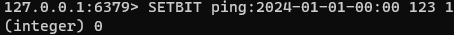
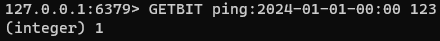
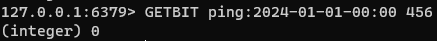

### 비트맵

레디스 비트맵은 문자열을 비트 벡터처럼 처리할 수 있는 문자열 데이터 유형이다.
하나 이상의 문자열에 대해 비트 연산을 수행할 수도 있다. 비트맵 사용 사례는 아래와 같다.

- 집합의 구성원이 정수 0-N에 해당하는 경우에 대한 효율적인 집합 표현.
- 파일 시스템이 권한을 저장하는 방식과 유사하게 각 비트가 특정 권한을 나타내는 객체 권한.

#### 예시

0부터 999까지로 레이블이 지정된 1000개의 센서가 배치되어있다고 가정하자. 지정된 센서가 한 시간 내에 서버에 ping을 호출했는지의 여부를 신속히 파악하려한다.

키로써 현재 시간을 참조하는 비트맵을 사용하여 시나리오를 수행한다.

- 센서 123은 2024년 1월 1일 00:00 시간 내에 서버에 핑을 호출한다.

- 센서 123이 2024년 1월 1일 00:00에 서버에 핑을 호출했는지 확인한다.

- 센서 456은 호출되지 않았으므로 결과가 0으로 출력된다.

#### 기본명령
- SETBIT : 제공된 오프셋의 비트를 0 또는 1로 설정한다.
- GETBIT : 입력된 오프셋의 비트 값을 반환한다.
- BITOP : 하나 이상의 문자열에 대해 비트 연산을 수행한다.

#### 성능

SETBIT와 GETBIT는 O(1)의 성능을 보인다. BITOP은 O(n)이며, 여기서 n은 비교에서 가장 긴 문자열의 길이이다.
