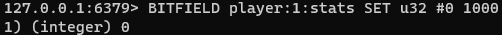
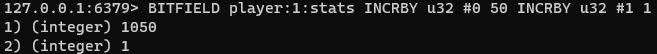
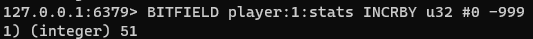
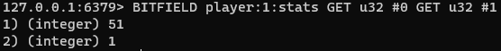

### 비트필드

Redis 비트 필드를 사용하면 임의 비트 길이의 정수 값을 설정하거나 증분을 설정할 수 있다.

예를들어 부호 없는 1비트 정수에서 부호 있는 63비트 정수에 이르기까지 무엇이든 연산할 수 있다.

이러한 값은 이진 인코딩된  Redis 문자열을 사요앟여 저장된다.
비트필드는 Atomic Read/Write 및 증분 작업을 지원하므로 카운터 및 유사한 숫자 값을 관리하는데 적합하다.

#### 예시

온라인 게임에서 활동을 추적한다고 가정한다. 각 플레이어에 대해 두 가지 중요한 지표인 골드 총량과 죽인 몬스터 수를 관리하려한다.
해당 플레이어는 게임 중독이 심해, 최소 32bit 길이어야한다.

플레이어당 하나의 비트 필드로 이러한 카운터를 나타낼 수 있다.

- 새로운 플레이어는 1000골드 (으프셋 0의 카운터)로 튜토리얼을 시작한다.

- 왕자를 포로로 잡고 있는 고블린을 죽인 후 획득한 50골드를 더하고 "살해"카운터를 증가시킨다.

- 대장장이에게 999골드짜리 전설적인 녹슨 단검을 구입한다.

- 플레이어 통계 읽기

#### 기본 명령
- BITFIELD : 하나 이상의 값을 원자적으로 설정 또는 증가하거나 읽을 수 있다.
- BITFIELD_RO : 읽기 전용으로 BITFIELD 변형이다.

#### 성능
BITFIELD는 O(n)이며, 여기서 n은 액세스한 카운터의 수이다.