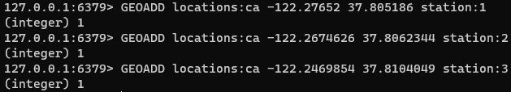
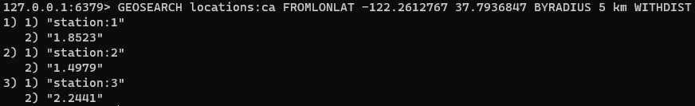

### Geospatial(지형 공간)

> Redis 7.0.0 버전 이상부터 사용 가능

Redis Geospatial 인덱스를 사용하면 좌표를 지정하고 검색할 수 있다.
이 데이터 타입은 주어진 반경 또는 경계 내 가까운 지점을 찾는데 유용하다.

#### 예시

현재 위치에서 가장 가까운 모든 전기 자동차 충전소를 찾을 수 있는 모바일 앱을 구축한다고 가정한다.
Geospatial 인덱스에 여러 전기 자동차 충전소 위치를 추가한다.

지정된 위치에서 반경 5Km 이내의 모든 위치를 찾고 각 위치끼리의 거리를 반환한다.

#### 기본 명령

- GEOADD Geospatial 인덱스에 주어진 위치를 추가한다.(longitude는 latitude 뒤에 위치해야함)
- GEOSEARCH 경계 박스 내 또는 주어진 반경 내 인덱스에 존재하는 대상을 반환한다.
