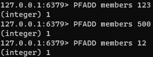
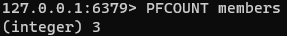

### HyperLogLog

HyperLogLog는 집합의 카디널리티를 추정하는 데이터 구조이다.

확률적 데이터 구조로써 HyperLogLog는 효율적인 공간 활용을 위해 완벽한 정확도를 제공한다.

Redis HyperLogLog 구현은 최대 12KB를 사용하고 0.81%의 표준 오류를 제공한다.

#### 예시

- HyperLogLog에 몇가지 항목을 추가한다.

- 집합의 구성원 수를 추정한다.

#### 기본 명령
- PFADD : HyperLogLog에 항목을 추가한다.
- PFCOUNT : 집합에 있는 항목 수의 추정치를 반환한다.
- PFMERGE : 둘 이상의 HyperLogLog를 하나로 결합한다.

#### 성능
HyperLogLog는 최대 18,446,744,073,709,551,616($2^64$) 요소가 있는 집합의 카디널리티를 추정할 수 있다.