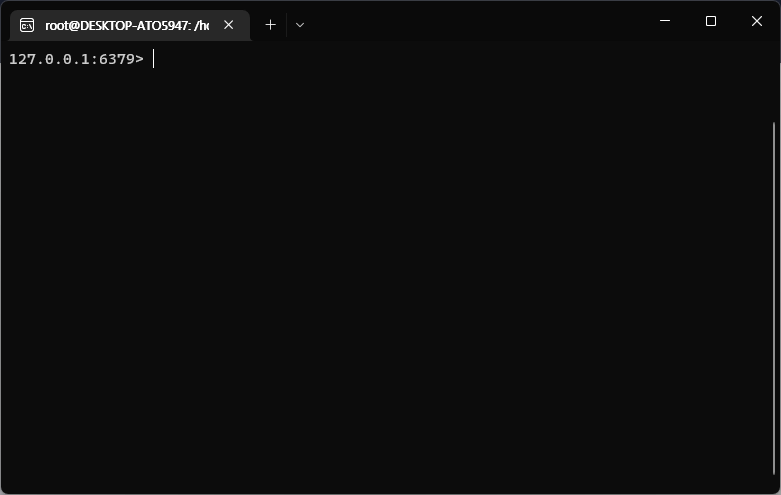
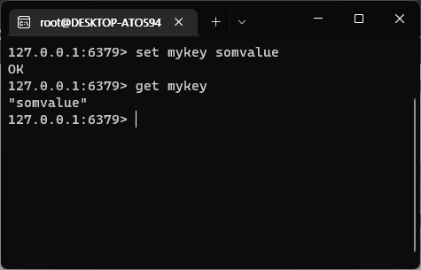

# 02. Redis 사용하기

외부 프로그램에서 Redis 에 접속할때는 TCP 소켓과 Redis 특정 프로토콜을 사용하여 Redis와 통신할 수 있다. 또한, 다양한 프로그래밍 언어 기반으로 Redis 클라이언트 라이브러리를 제공한다.

본 포스팅에서는 라이브러리를 사용하지 않고 `redis-cli` 만을 사용하여 Redis 사용하는 방법에 대해 기술한다.

Redis 서버의 기본 포트는 6379이며, `redis-cli`를 실행하면 localhost의 6379포트에 해당하는 Redis 서버로 연결을 수행한다.

Redis 를 다루기 위해서는 Redis가 제공하는 데이터 타입에 대해 이해해야한다. 어떤 데이터 타입으로 데이터를 저장할 수 있는지를 말이다.

## Redis 데이터 타입 알아보기

Redis 키는 이진안전함수로 이루어져있다. 이 말인즉슨, "foo"와 같은 무자열에서 JPEG 파일의콘텐츠에 이르기까지 모든 바이너리 시퀀스를 키로 사용할 수 있다는 의미이다.

단, Key를 작성하는데에 몇가지 규칙을 따른다.
- 매우 긴 형태의 키는 좋지 못하다. 에를 들어 1024바이트의 키는 메모리 측면에서 뿐만 아니라, 데이터 셋에서 키를 조회하려면 비용이 많이들기 때문이다.
- 매우 짧은 키 또한 좋지 않을 수 있다. 예를 들어 "user:1000:followers"라는 키를 축약하여 "u1000flw"로 사용한다고 한들 메모리는 상대적으로 적게 사용하겠지만, 가독성 저하의 단점이 있다.
- 어느정도의 스키마를 고수하는 것이 좋다. 위의 예시처럼 대상의 구분을 콜론으로 짓거나, 하위 구분을 위해 대시 또는 점을 사용하는 것도 좋은 방법이다.
  - user:1000:followers
  - user:1000:new-user
  - user:1000:old-user
- 허용되는 최대 키의 길이는 512MB이다.

### 문자열
Redis 문자열 유형은 Redis 키와 연결할 수 있는 가장 간단한 유형이다. Memcached의 유일한 Key 유형이기도 해서, 익숙하게 사용할 수 있다.
문자열 키의 값으로 HTML 조각이나 페이지 캐싱과 같은 다양한 방법으로 활용할 수 있다.

