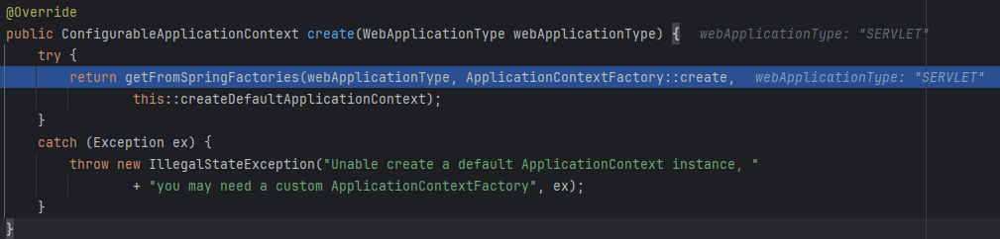

# 01. IoC 컨테이너

IoC 컨테이너는 Spring Framework에서 객체를 관리하는 창고로 정의할 수 있다.

객체를 관리하기는 하는데, IoC 원리에 의해 객체를 관리한다.

여기서 말하는 **IoC** 는 **Inversion of Control**의 약자인데, 한글로 쉽게 풀이하면 제어의 역전이다.

제어의 역전이라는 표현자체가 굉장히 어색한데(알고 있어도 어색해.. ) 아래의 코드를 통해, 제어의 역전을 이해해보자.


Java에서 Non-static한 객체를 정의하려면 new 키워드를 사용하여 인스턴스를 생성해야한다.

아래는 Service를 사용하기 위해, Controller에 Service 인스턴스를 생성하여 Controller 인스턴스르 생성하는 전통적인 방식이다.

### 객체 생성하기
```java
Service s = new ServiceImpl();
Controller c = new ControllerImpl(s);
```

하지만, Spring Framework에서는 필요한 객체(Bean)를 직접 만들고, 필요한 의존성을 직접 주입(DI;Dependency Injection)한다.

```java
@Configuration
public class AppConfig {
    @Bean
    public Service service() {
        return new ServiceImpl();
    }

    @Bean
    public Controller controller() {
        return new Controller(service());
    }
}
```

다시 말해, `실제로 인스턴스를 만들고 필요한 인스턴스를 매개로 전달하는 행동`(제어)들을 직접 수행하지 않고, Spring Framework가 직접 이 역할을 수행하는 것이다.

그래서 이러한 제어를 수행하는 주체가 역전되었다고하여 제어의 역전이라고 부른다.

---

## IoC 컨테이너의 역할
IoC 컨테이너는 위에서 살펴본 바와 같이, IoC 매커니즘을 통해 객체를 생성하고 이를 관리하며, 객체 상호간의 의존 관계를 관리한다.
뿐만아니라, 프로파일, 속성, 외부 설정 정보들을 관리하고, 이벤트 시스템을 제공하며, 리소스를 로딩한다.

- Bean 관리 : 객체(Bean)의 생성, 초기화, 소멸까지 전 생명주기를 관리
- 의존성 주입(DI) : Bean 간의 의존관계를 연결
- 환경 관리 : 프로파일, 속성, 외부 설정 파일 관리
- 이벤트 발생/리스닝 : ApplicationEvent 기반의 이벤트 시스템 제공
- 리소스 로딩 : 파일, 클래스패스, URL 등 다양한 자원 로딩 지원

## IoC 컨테이너의 실제 구현체
IoC 컨테이너의 인터페이스 계층 구조는 BeanFactory와 ApplicationContext로 나눌 수 있다.

BeanFactory는 말그대로 Bean 공장이다. Bean을 생성하고 조회 등 Bean의 생명주기를 관리하는 기능을 제공해준다.

ApplicationContext는 IoC의 확장판 격이다. BeanFactory를 상송받아 애플리케이션 전반의 기능을 담당한다.

때문에 BeanFactory 외에도 또다른 인터페이스를 동시 구현한다.

- EnvironmentCapable
- MessageSource
- ApplicationEventPublisher
- ResourcePatternResolver
- Lifecycle

```java
package org.springframework.context;

import org.springframework.beans.factory.HierarchicalBeanFactory;
import org.springframework.beans.factory.ListableBeanFactory;
import org.springframework.beans.factory.config.AutowireCapableBeanFactory;
import org.springframework.core.env.EnvironmentCapable;
import org.springframework.core.io.support.ResourcePatternResolver;
import org.springframework.lang.Nullable;

public interface ApplicationContext extends EnvironmentCapable, ListableBeanFactory, HierarchicalBeanFactory, MessageSource, ApplicationEventPublisher, ResourcePatternResolver {
    @Nullable
    String getId();

    String getApplicationName();

    String getDisplayName();

    long getStartupDate();

    @Nullable
    ApplicationContext getParent();

    AutowireCapableBeanFactory getAutowireCapableBeanFactory() throws IllegalStateException;
}

```

세부적인 내용은 다음에 다루기로 하고, IoC 컨테이너에 다시 집중해보자.

---

## Bean은 그럼 어떻게 IoC 컨테이너가 생성하고 관리하지?

IoC 컨테이너는 Bean을 생성하고 관리한다고 앞서 설명했다. 그러면 어떻게 생성하고 관리하는지를 확인해볼 필요가 있다.

Spring 기반의 Application이 실행되는 과정을 통해 어떻게 IoC 컨테이너가 만들어지고 Bean을 등록하는지를 살펴보자.

```scss
SpringApplication.run()
  ├─ prepareEnvironment()
  ├─ createApplicationContext()
  ├─ prepareContext()
  ├─ refreshContext()
  ├─ afterRefresh()
```

여기 Demo Application이 있다. SpringApplication.run() 정적 메서드를 호출하면, Spring Framework의 IoC 컨테이너(Application Context)가 생성되고,
BEan들이 등록/초기화되는 전체 흐름이 시작된다.
```java
@SpringBootApplication
public class DemoApplication {
    public static void main(String[] args) {
        SpringApplication.run(DemoApplication.class, args);
    }
}
```

SpringApplication 클래스를 살펴보자.

run 메서드가 호출되면, primarySource(여기서는 DemoApplication.class)를 필드에 주입하고, 실행을 이어나간다.

```java
package org.springframework.boot;

public class SpringApplication {
    public static ConfigurableApplicationContext run(Class<?> primarySource, String... args) {
        return run(new Class<?>[]{primarySource}, args);
    }

    public static ConfigurableApplicationContext run(Class<?>[] primarySources, String[] args) {
        return new SpringApplication(primarySources).run(args);
    }

    public ConfigurableApplicationContext run(String... args) {
        Startup startup = Startup.create();
        if (this.registerShutdownHook) {
            SpringApplication.shutdownHook.enableShutdownHookAddition();
        }
        DefaultBootstrapContext bootstrapContext = createBootstrapContext();
        ConfigurableApplicationContext context = null;
        configureHeadlessProperty();
        SpringApplicationRunListeners listeners = getRunListeners(args);
        listeners.starting(bootstrapContext, this.mainApplicationClass);
        try {
            ApplicationArguments applicationArguments = new DefaultApplicationArguments(args);
            ConfigurableEnvironment environment = prepareEnvironment(listeners, bootstrapContext, applicationArguments);
            Banner printedBanner = printBanner(environment);
            context = createApplicationContext();
            context.setApplicationStartup(this.applicationStartup);
            prepareContext(bootstrapContext, context, environment, listeners, applicationArguments, printedBanner);
            refreshContext(context);
            afterRefresh(context, applicationArguments);
            startup.started();
            if (this.logStartupInfo) {
                new StartupInfoLogger(this.mainApplicationClass).logStarted(getApplicationLog(), startup);
            }
            listeners.started(context, startup.timeTakenToStarted());
            callRunners(context, applicationArguments);
        } catch (Throwable ex) {
            throw handleRunFailure(context, ex, listeners);
        }
        try {
            if (context.isRunning()) {
                listeners.ready(context, startup.ready());
            }
        } catch (Throwable ex) {
            throw handleRunFailure(context, ex, null);
        }
        return context;
    }
}
```

여기서 중요한 부분은 Context를 생성하고, ApplicationContext를 준비하는 지점이다.
IoC컨테이너가 만들어지고 DI가 일어나는 지점을 중점적으로 다시 다뤄보자.

환경정보를 바탕으로 ConfigurableEnvironmnet를 획득하고,

그다음 바로 createApplicationContext()를 통해 ApplicationContext를 만든다.
그리고 이 context에 prepareContext와 refreshContext 메서드를 호출해서, 컨텍스트를 정의하고,
최종적으로 context를 반환하는 구조이다.

```java
try {
    ApplicationArguments applicationArguments = new DefaultApplicationArguments(args);
    ConfigurableEnvironment environment = prepareEnvironment(listeners, bootstrapContext, applicationArguments);
    Banner printedBanner = printBanner(environment);
    context = createApplicationContext();
    context.setApplicationStartup(this.applicationStartup);
    prepareContext(bootstrapContext, context, environment, listeners, applicationArguments, printedBanner);
    refreshContext(context);
    afterRefresh(context, applicationArguments);
    startup.started();
    if (this.logStartupInfo) {
        new StartupInfoLogger(this.mainApplicationClass).logStarted(getApplicationLog(), startup);
    }
    listeners.started(context, startup.timeTakenToStarted());
    callRunners(context, applicationArguments);
} catch (Throwable ex) {
    throw handleRunFailure(context, ex, listeners);
}
```

createApplicationContext() 메서드의 javadoc을 이해해보면, ApplicationContext를 생성하기 위해 사용되는 전략 메서드라고한다.

개발자가 명시한 ApplicationContext클래스나 ApplicationContextxFactory가 있다면 그걸 우선적으로 사용하고,

그렇지 않으면 적절한 기본 컨텍스트 타입으로 자동 선택하여 생성한다고 되어있다.

그리고, 아직 refresh 되지 않은(Bean이 로드되지 않은) ApplicationContext 인스턴스라고 되어있다.

초기화를 마친 Application Context로 이해하면 될 것 같다.

```java
	/**
	 * Strategy method used to create the {@link ApplicationContext}. By default this
	 * method will respect any explicitly set application context class or factory before
	 * falling back to a suitable default.
	 * @return the application context (not yet refreshed)
	 * @see #setApplicationContextFactory(ApplicationContextFactory)
	 */
	protected ConfigurableApplicationContext createApplicationContext() {
		return this.applicationContextFactory.create(this.webApplicationType);
	}
```

ApplicationContextFactory 인터페이스의 create 인스턴스 메서드 구현체를 살펴보면 아래와 같다.


Javadoc의내용과 같이 별도로 명시한 ApplicationContext가 존재하지 않기때문에 DefaultApplicationContextFactory를 통해 컨텍스트가 생성될 것이다.

실제로 SpringApplication 서비스를 구동하면 DefaultApplicationContextFactory의 create 메서드로 진입되는 것을 확인할 수 있다.


실제로 생성되는 기본 ApplicationContext 메서드의 마지막 지점이다. AotDector는 AoT 모드인지를 확인하는 절차를 수행하는데, 특이사항이 없기때문에

이 Application에서는 AnnotationConfigApplicationContext가 생성된다.

```java
	private ConfigurableApplicationContext createDefaultApplicationContext() {
		if (!AotDetector.useGeneratedArtifacts()) {
			return new AnnotationConfigApplicationContext();
		}
		return new GenericApplicationContext();
	}
```

이 AnnotationConfigApplicationContext의 생성자는 BeanDefinitionReader와 ClassPathBeanDefinitionScanner를 주입한다.

(주입되는 각각의 BeanDefinition에 대한 내용은 뒤에서 좀더 자세히 다루도록 하겠다.)

이렇게 생성된 ApplicationContext를 가지고, context 준비 단계를 진행한다. 

이 준비단계에서는 

```java
private void prepareContext(DefaultBootstrapContext bootstrapContext, ConfigurableApplicationContext context,
			ConfigurableEnvironment environment, SpringApplicationRunListeners listeners,
			ApplicationArguments applicationArguments, Banner printedBanner) {
		context.setEnvironment(environment);
		postProcessApplicationContext(context);
		addAotGeneratedInitializerIfNecessary(this.initializers);
		applyInitializers(context);
		listeners.contextPrepared(context);
		bootstrapContext.close(context);
		if (this.logStartupInfo) {
			logStartupInfo(context.getParent() == null);
			logStartupProfileInfo(context);
		}
		// Add boot specific singleton beans
		ConfigurableListableBeanFactory beanFactory = context.getBeanFactory();
		beanFactory.registerSingleton("springApplicationArguments", applicationArguments);
		if (printedBanner != null) {
			beanFactory.registerSingleton("springBootBanner", printedBanner);
		}
		if (beanFactory instanceof AbstractAutowireCapableBeanFactory autowireCapableBeanFactory) {
			autowireCapableBeanFactory.setAllowCircularReferences(this.allowCircularReferences);
			if (beanFactory instanceof DefaultListableBeanFactory listableBeanFactory) {
				listableBeanFactory.setAllowBeanDefinitionOverriding(this.allowBeanDefinitionOverriding);
			}
		}
		if (this.lazyInitialization) {
			context.addBeanFactoryPostProcessor(new LazyInitializationBeanFactoryPostProcessor());
		}
		if (this.keepAlive) {
			context.addApplicationListener(new KeepAlive());
		}
		context.addBeanFactoryPostProcessor(new PropertySourceOrderingBeanFactoryPostProcessor(context));
		if (!AotDetector.useGeneratedArtifacts()) {
			// Load the sources
			Set<Object> sources = getAllSources();
			Assert.notEmpty(sources, "Sources must not be empty");
			load(context, sources.toArray(new Object[0]));
		}
		listeners.contextLoaded(context);
	}
```