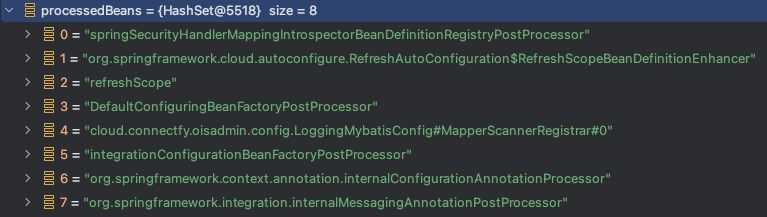
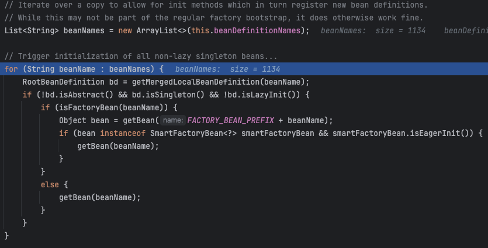
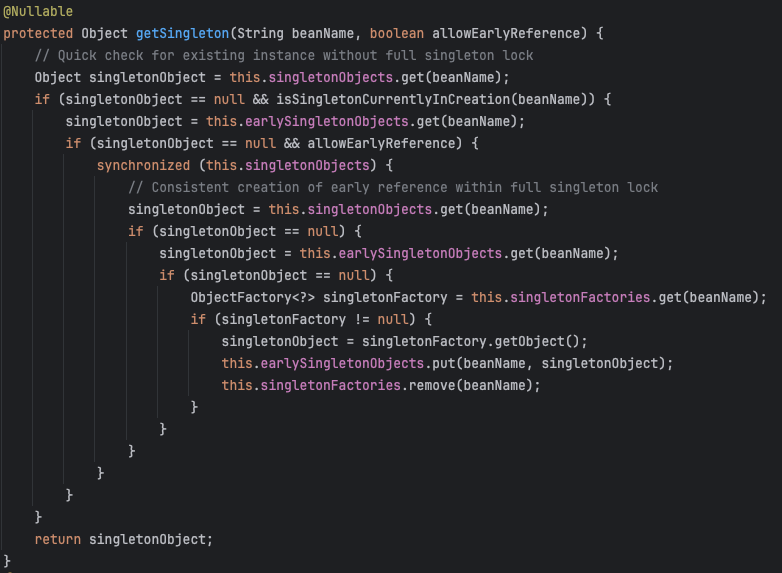
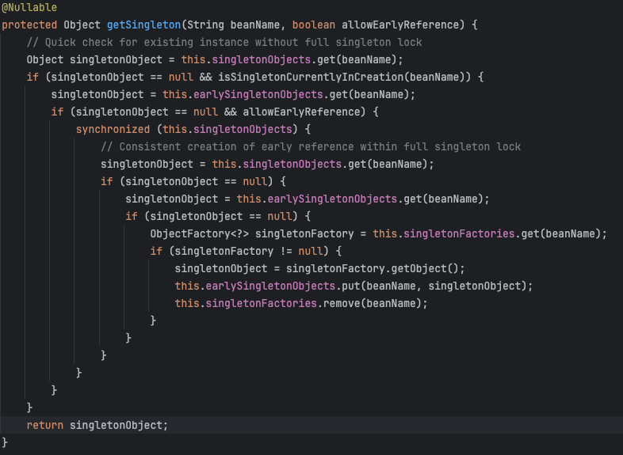
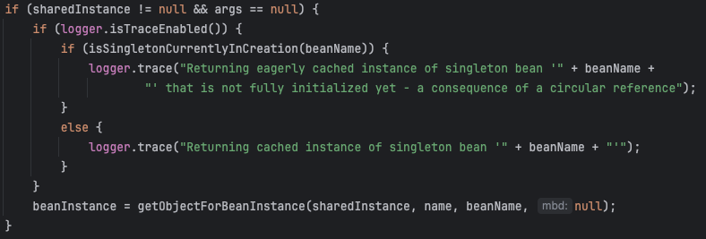
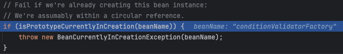
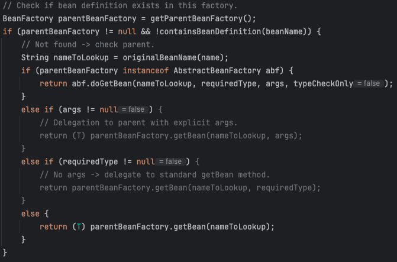
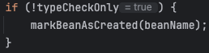
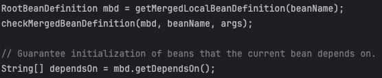
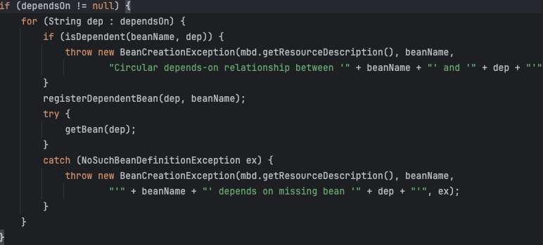

# 04. Bean 생명주기
Bean은 앞서 IoC 컨테이너를 이야기하면서 언급된 Application Context 즉, IoC 컨테이너가 관리하는 객체를 말한다.

이 페이지에서는 흔히들 관습적으로 말하는 Bean의 생명주기 절차를 열거하는게 아닌, 각 절차별로 어떠한 작업들을 왜,

그리고 왜 하필 그때 수행하는지 등 다양한 정보를 다뤄보려고 한다. (이놈의 이해가 안되면 정리가 안되는 성격..)

관습적으로 이야기하는 Bean의 생명주기는 이러하다
```scss
IoC 컨테이너 생성 -> Bean Definition 정의 -> Bean 인스턴스 생성 -> DI 수행 -> Before BeanBostProcess -> Bean 초기화 ->
After BeanBostProcess -> 실제로 사용되는 중 -> 소멸 전 콜백 수행 -> 소멸
```

## IoC 컨테이너 생성과 Bean Definition 정의

[01.IoC컨테이너](01.IoC컨테이너.md) 에서 스프링 애플리케이션이 시작되고, IoC 컨테이너가 생성되면서 여러 초기화 작업을 하는 내용을 다룬 바 있다.

그리고 그때 당시에 BeanDefinition이 Bean Factory Post Processor에 의해 Bean 정보들을 수집하는 일련의 작업들을 진행한다.

IoC 컨테이너가 생성되면 BeanFactory를 획득(obtainFreshBeanFactory()) 하고, Bean Factory Post Processor 들을 정의(등록)한다.

Bean Factory Post Processor는 크게 2가지로 분류할 수있다.

하나는 `RegularPostProcessor`(BeanDefinitionRegistryPostProcessor를 제외한 나머지) 이고,

또다른 하나는 `BeanDefinitionRegistryPostProcessor` 이다.

BeanFactory에 앞서 정의된 Bean Factory PostProcessor를 순회하며, 위 두가지를 구분하여 정의하고,

실제로 BeanDefinition 내 DefinitionMap을 구성할 Bean들의 정보(메타데이터)를 수집한다.

아래는 BeanDefinitionRegistryPostProcessor 에 해당하는 대상들이며, 

invokeBeanDefinitionRegistryPostProcessors 메서드를 수행하여, 실제로 beanDefinitionMap에 Bean으로 정의될 모든 요소들을 획득한 결과이다.




그리고 나머지 `RegularPostProcessor` 에서는 해당하는 Bean Factory Post Processor를 순회하면서, 이는 BeanDefinitionMap을 새롭게 추가하거나 제거

정의 하는 행위가 아닌 이미 존재하는 BeanDefinition의 메타데이터(가령, Property값, Scope, DepondsOn 과같은..)를수정하는 역할을 수행한다.

여기까지가 Bean 생명주기에서 IoC 컨테이너생성 Bean Definition 정의 구간이다.

---
진짜로 빈 인스턴스를 만드는 시점으로 가보자.

BeanFactory Refresh 수행하는 거의 마지막 구간에 `finishBeanFactoryInitialization` 이라는 메서드에서, BeanDefinition을 동결하고,

정의된 BeanDefinitionMap을 가지고 추상이 아닌, non-lazy한, singleton인 Bean의 인스턴스를 만드는 메인루프로 진입한다.(`beanFactory.preInstantiateSingletons()`)

beanDefinition 이름 정보를 List로 선언하여, 모두 순회하면서 betBean 메서드를 호출해준다.



여기서 짚고 넘어가야할 부분은 앞서 말한 추상이아닌, non-lazy한 singleton인 Bean의 인스턴스를 만든다고 했는가 이다.

먼저, 추상 BeanDefinition은 인스턴스를 만들 대상이 아니다. 부모용 BeanDefinition 정의이기 때문에 실제 인스턴스는 구체 클래스를 대상으로 만들어야한다.

non-lazy라함은 Eager한 BeanDefinition을 말한다.  `@Lazy` 애너테이션이 붙어있는 Bean이거나, `lazy-init=true` 속성을 갖은 Bean은

지연 초기화를 수행한다. 때문에 굳이 Bean을 생성하는 시점을 시작하는 지점에 할 필요가 없다. (물론 실제로 사용되는 시점에는 빈 생명주기대로 돌긴한다. 아닌경우도 있지만)

그리고 끝으로 Singleton인 Bean은 Bean Scope를 의미하는데 실제로 싱글톤 스코프의 Bean은 단 한개의 인스턴스만을 생성하고, 사용할때 이 인스턴스의 프록시 객체를

가지고 활용하기 때문에, 싱글턴 빈의 인스턴스를 미리 만들어 두어야한다.(이부분은 Bean Scope를 다룰 때 더 자세히 다루도록 한다.)

인스턴스를 만드는 방식은 생각보다 너무 익숙한 방식이다. beanFactory로부터 대상 beanName을 `getBean`하는 것이다.

이 getBean 안에서, 인스턴스 생성, 의존 주입, 인스턴스 초기화, After Bean Post Processor 동작들이 모두 일어난다.

그 저명한 getBean을 한번 뜯어도보록하자.

## 대망의 GetBean

```scss
getBean
  -> doGetBean
    -> getSingleton()
      -> createBean()
        -> doCreateBean()
          -> createBeanInstance()
            -> populateBean()
              -> initializeBean()
```

doGetBean메서드에서는, 싱글톤 타입의 해당 이름의 빈이 존재하는지를 검증하고 없으면 빈 인스턴스를 생성하도록 호출한다.

이때 getSingleton()을 호출하여, 싱글톤 캐시 조회 및 순환참조를 대응하는 작업을 수행한다.

singletonObjects 내에 있는 이미 완성된 싱글톤 인스턴스가 존재하면, 대상을 반환한다.

그렇지 않은 경우, 아직 초기화는 다 끝나지 않은 상태이지만, 순환 참조로 인해 다른 빈이 먼저 참조될 수 있도록 대기중인 earlySingletoneObjects 대상인지

확인하고, 맞을 경우 그 singletonObject를 반환한다.

혹시나 아직 실제 객체는 만들어지지는 않았지만, 대신 만들어줄 수 있는 ObjectFactory에만 담겨있으면, `singletonFactory.getObject()`를 호출하여,

그 결과를 담아 반환한다.



다시한번 정리를 해보면, 이미 사전 캐싱된
- singletonObjects 내 존재여부
- earlySingletonObjects 내 존재여부
- singletonFactories 내 존재여부

를 확인해서, 있을 경우 그 대상을 반환하는 구조로 되어있다.

이렇게 까지 단계별로 캐싱을 하는 이유는 싱글톤은 단 하나만 생성된다고 보장해주기 위함이다. getBean을 호출했을 때, 무조건적으로 단 `한 개`를 보장하기 위한,

방어코드로 볼 수 있다.(물론 여기서만 하는건 아니다..)

다시 doGetBean으로 돌아와서, getSingleton 호출로 얻어진 주체가 있으면, 그리고 전달된 매개정보 args가 없으면, 이미 이 singleton이 생성중 상태인지를 확인해서,

`getObjectForBeanInstance()` 메서드를 수행한다.

여기서 중요한 점은, args를 왜 조건으로 매달았는지와, 아래의 `isSingletonCurrentlyInCreation(beanName)` 부분을 잘 이해해야 한다.


아무리 싱글톤 스코프더라도, 다른 매개를 기준으로 새로운 싱글톤 빈을 생성해야할 수도 있다. 때문에 args가 없으면서도, getSingleton 호출록 획득된 주체를 기준으로 검증한다.

그리고 `isSingletonCurrentlyInCreation(beanName)`은 현재 생성중인 상태인지를 확인하는 행위이다. 가령, 아직 완전히 초기화되지 않은 early singletone 이거나,

순환 참조 떄문에 앞서있는 Singleton 생성을 기다리고 있는 등의 경우가 이에 해당한다.

그리고나서 `getObjectForBeanInstance(sharedInstance, name, beanName, null)` 을 호출해서, 실제로 획득가능한 Bean의 상태라면 beanInstance를 반환한다.

여기까지가 이미 일반적으로 존재하는 Bean을 획득하는 방법이고, 앞서 getSingleton을 호출했을 때, 결과가 null이라는 본격적으로 doCreateBean()을 수행해야한다.

### 프로토타입 빈일 경우, 생성중인지 확인

먼저 지금 호출된 getBean이 프로토타입인지, 그리고 이미 생성중인 prototype인지 검증한다.



프로토타입 스코프의 경우에는 매번 새로 인스턴스를 만드는 구조여서 A -> B -> A 와 같은 순환 참조에 걸리면

A가 B를 만드는데 B가 A를 만들고 그런데 또 B를 만들면서 무한 루프에 빠져 stackOverFlow로 끝날 수 있다. 이러한 부분을 미연 방지한다.

만약 이미 생성중인 상태에서 또다시 그 prototype 빈을 만들려고한다면, 무조건 순환 참조라 판단하고 예외를 던진다.

### BeanDefinition을 찾을때까지 부모 BeanFactory

현재 BeanFactory안에 찾으려는 BeanDefinition이 없을 경우 부모 컨테이너에게 위임하여, 찾도록 한다.



왜 이렇게 수행하냐면, 스프링의 BeanFactory가 계층 구조의 구성이기 떄문이다. 이 말인즉슨, 재귀적으로 상위 BeanFactory를 호출하면서

BeanDefinition에 대상 Bean이 존재하는지를 lookUp하고, 찾을때까지 이를 수행하다가 찾으면, 그 조상 BeanFactory에게 getBean을 위임한다.

### markBeanAsCreated

만약 doGetBean을 호출할 당시 typeCheck목적으로 호출된게 아니라면(매개로 이를 전달함) 생성 시작했다! 라고 플래그를 세워준다.



### RootBeanDefinition 획득

합쳐진 로컬 BeanDefinition을 얻는 작업을 수행한다. `LocalBeanDefinition`이랑 `RootBeanDefinition`이 뭐냐면,

각 BeanDefinition은 여러 소스들이 섞일 수 있다. 자식 부모 정의, @Scope, @Lazy, @Configuration 등 여러 메타데이터, Profile, Role 들이

바로 LocalBeanDefinition에 해당한다. 이렇게 파편화된 LocalBeanDefinition을 합쳐 최종적으로 사용가능한 RootBeanDefinition을 획득한다.

그리고 `checkMergedBeanDefinition` 메서드를 호출해서, 실제로 인스턴스를 만들어도 되는 상태인지를 한번더 점검함다.

개념적으로

- abstract 는 아닌지
- factoryMethod, constructorArgm beanClass 등의 정보등이 일관성있게 잘 셋업되었는지
- scope나 roel에 문제는 없는지

가 이에 해당한다.

여기까지 통과하면 createBean을 수행해도 됨이 증명된 셈이다.



그다음으로는 생성 순서 보장을 위해 DependsOn이 존재하는지를 확인하고, 순환 체크를 수행한다.

dependsOn 애너테이션이 해당 beanDefinition에 정의되어있으면, 의존관계정보를 등록해둔다.

여기서 말하는 의존관계정보는 현재의 Bean이 만들어지기 전에 의존하고 있는 대상이 소멸시에도 먼저 소멸해야한다는 의존관계이다.

그리고 의존하는 대상을 강제로 getBean을 호출하여 초기화 시킨다.



### 