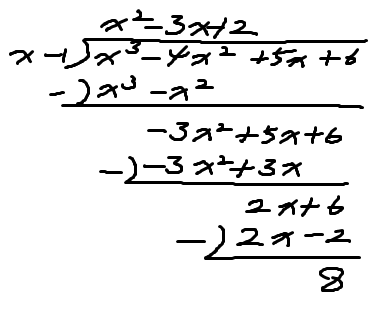

# 다항식의 연산 (4)

## 다항식의 나눗셈

- 나누고자하는 식을 **내림차순** 정리 -> 직접 나눔

## 문제풀이

### 예제 5 다음 물음에 답하시오.

#### (1) 다항식 $f(x)=x^3-4x^2+5x+6$을 $g(x)=x-1$로 나누엇을 때의 몫 $Q(x)$와 나머지 $R(x)$를 구하여 $f(x)=g(x)Q(x)+R(x)$의 꼴로 나타내시오.

- 몫 $(Q(x)) = x^2-3x+2$
- 나머지 $(R(x)) = 8$
- 검산식
  - $x^3-4x^2+5x+6 = (x-1)(x^2-3x+2) + 8$