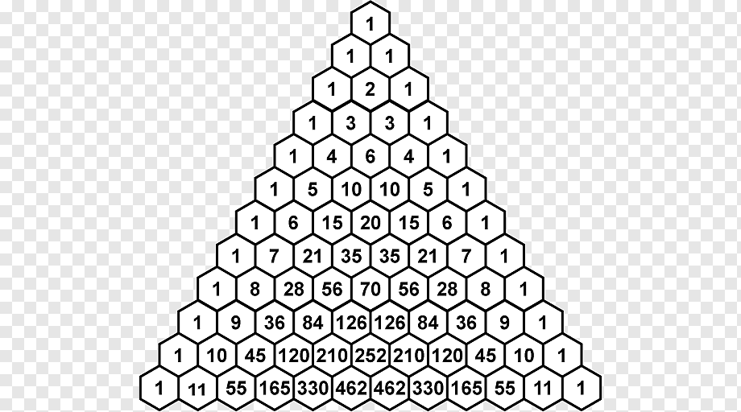

# 파스칼의 삼각형

파스칼의 삼각형을 이하기 앞서, 먼저 파스칼의 삼각형이 어떻게 생겼는지 확인하보자.

맨위에서 두번째 줄인 1과 1과 그 다음 줄인 1, 2, 1을 보면 규칙이 있다.
두수의 합은 아래 가운데에 쓰고, 전체 모양은 좌우 대칭을 이룬다.

1+1인 2를 가운데에 쓰고 좌우로 1과 1이 그대로 대려왔다.

그다음 1,2,1과 1,3,3,1을 보자.
1+2인 3과 2+1인 3이 가운데에 쓰이고 또 좌우 대칭을 이룬다.

각 n 번째 줄의 숫자들은 $(x+1)^n$ 을 전개한 식의 계수들만 정리한 것이다.

- $(x+1)^1 = 1x + 1$
- $(x+1)^2 = x^2 + 2x + 2$
- $(x+1)^3 = 1x^3 + 3x^2 + 3x + 1$
- $(x+1)^4 = 1x^4 + 4x^3 + 6x^2 + 4x + 1$

이항정리에서 각 항의 계수는 $_nC_r$의 형태로 쓸 수 있으므로 $_nC_r$의 형태로 다시 표현하면 아래의 그림과 같다.

각 n번쨰 줄은 $_nC_r$의 n이 동일하면

파란색 선과 같이, 차수가 하나씩 증가하게 되므로 r이 1씩 증가합니다.

녹색 선과 같이, 차수가 같은 항들이므로 r이 동일합니다.
