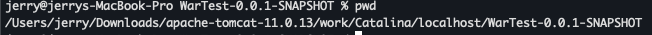

# 09-1-2. Context 시작하기
여태 것은 살짝 뼈대같은 느낌이다. Context 부터가 실제 web.xml 파싱, 서블릿/필터/리스너 등록, init() 호출 등의 작업을 시작하는

앱 레벨 로직이 시작되는 자리라고 보면 된다. 그래서 Context가 뭐냐하면, 하나의 웹 애플리케이션으로 봐도 무방하다.

아래는 StandardContext 클래스의 상속 구조이다.
```scss
  +-------------------+
  |   ContainerBase   |
  +-------------------+
            ^
            |
+-------------------------------+
|         StandardContext       |
+-------------------------------+
| - ...                         |
+-------------------------------+
               / \
              /   \
             /     \
            v       v
+-------------+     +---------------------+
|   Context   |     |  NotificationEmitter|
+-------------+     +---------------------+
(Interface)          (Interface)
```

한번 본격적으로 Context를 시작해보자. 이 Context의 시작하기 작업은 꽤나 방대하기 떄문에 좀 끊어서 먼저 흐름을 설명해보겠다.

1. j2ee.state.starting 알림 발송
2. Naming & work 디렉토리 & Resource 준비
3. Loader / Cookie / Charset / JNDI 준비
4. 스레드 CCL 바인딩 * Loader/Realm 시작
5. CONFIGURE_START 이벤트 & 자식 (wrapper) 컨테이너 / 파이프라인 시작 & Manager 준비
6. 설정 성공 여부 검사 및 ServletContext에 각종 객체 주입
7. SCIs, 리스너, 보안 제약사항 검사
8. Manager.start(), 필터 시작, load-on-startup 서블릿 init
9. BackgroundProcessor 스레드 시작 & CCL 원복
10. 최종 결과 처리 및 상태 전이

꽤나 복잡하고, 처음나오는 용어도 많아서 굉장히 어렵다. 총 10단계로 나눠 각 단계별로 한번 자세하게 다뤄보자.

여기서 놓히면 정작 중요한 부분 빼먹는 느낌이니깐..

## 1. j2ee.state.starting 알림 발송
```java
// Send j2ee.state.starting notification
if (this.getObjectName() != null) {
    Notification notification =
            new Notification("j2ee.state.starting", this.getObjectName(), sequenceNumber.getAndIncrement());
    broadcaster.sendNotification(notification);
}
```
여기서 `Notification(javax.management.Notification)`과 `Broadcaster(javax.management.NotificationBroadcasterSupport)`가 나오게 되는데,

NotificationEmitter를 통해 Java EE의 javax.management 패키지에 있는 인터페이스로 JMX MBean이 바깥으로 이벤트를 쏴줄 수 있게 해주는 역할을 수행한다.

그러니깐, j2ee.state.starting 이라고 JMX를 모니터링하는 시스템(NotificationListener)에서 이 이벤트 정보를 수신한다.

## 2. Naming & work 디렉토리 & 리소스 준비
```java
// Currently this is effectively a NO-OP but needs to be called to
// ensure the NamingResources follows the correct lifecycle
if (namingResources != null) {
    namingResources.start();
}

// Post work directory
postWorkDirectory();

// Add missing components as necessary
if (getResources() == null) { // (1) Required by Loader
    if (log.isTraceEnabled()) {
        log.trace("Configuring default Resources");
    }

    try {
        setResources(new StandardRoot(this));
    } catch (IllegalArgumentException e) {
        log.error(sm.getString("standardContext.resourcesInit"), e);
        ok = false;
    }
}
if (ok) {
    resourcesStart();
}
```
### 네이밍 리소스 시작중 으로 상태 전이
먼저 LifecycleBase 구현체인 namingResources의 상태를 시작상태로 전이한다.

### 워킹 디렉터리 정의하기

이후, `postWorkDirectory()` 내부 메서드를 호출하여, 작업 디렉토리에 적합한 컨텍스트 속성을 설정한다.

이 postWorkDirectory 는 우리의 애플리케이션을 등록하기 위해 디렉터리를 구성하는 작업인 것인데, `webapps` 디렉터리에 작성된

`{something}.war` 파일을 읽어드리고, 대상 경로를 만드는 행위를 수행한다고 보면된다.

먼저 Context 인스턴스에 Working Directory가 존재하는지의 유무를 판별하여, 없으면, 정해진 규칙에 따라 Working Directory를 만든다.

이떄, `$CATALINA_BASE/work/EngineName/HostName/ContextPath` 와 같은형태로 워킹디렉터리를 설정한다. 없으면 디렉터리를 만들어주는 작업도 수행한다.

아래는 Wartest-0.0.1-SNAPSHOT.war 파일을 webapps 디렉터리에 넣고, 실행했을 때 자동으로 생성된 워킹 디렉터리의 결과 예시이다. 



### 리소스 확인하고 없으면 정의하기
Context 인스턴스에 리소스가 존재하지 않으면, 새로운 리소스를 생성하는 작업을 수행한다.
여기서 말하는 리소스는 JNDI의 <Resource>와는 전혀 다른 개념으로,
웹 리소스(static 파일, JSP, /WEB-INF/classes, /WEB-INF/lib 등) 을 의미한다.

웹 애플리케이션의 리소스들은 실제로 여러 물리적 위치(디렉터리, JAR, 클래스패스 등)에 흩어져 있다.
하지만 매 요청마다 파일 시스템을 직접 탐색하는 것은 비효율적이고, 구현상으로도 지나치게 로우레벨이기 때문에
톰캣은 이를 가상 리소스 계층(WebResourceRoot) 으로 통합 관리한다.

StandardRoot는 WebResourceRoot의 기본 구현체로,
사전 정의된 경로(WEB-INF/classes, WEB-INF/lib, 루트 정적 경로 등)를 기준으로 각 리소스 위치를 ResourceSet` 단위로 관리한다.

따라서 톰캣에서 리소스를 접근할 때는 파일 시스템에 직접 접근하지 않고, 반드시 Resource 객체를 통해 일관된 방식으로 접근하게 된다.

(즉, “파일시스템에 직접 접근하지 않는다”는 말은 “경로 추상화 계층을 거쳐 접근한다”는 의미다.)

결국 Context에 리소스가 정의되어 있지 않다면, 톰캣은 기본 구현체인 StandardRoot를 생성하여 등록하고, 이 컨텍스트가 필요로 하는 웹 리소스 계층을 초기화한다.

## 3. Loader / Cookie / Charset / JNDI 준비
```java
if (getLoader() == null) {
    WebappLoader webappLoader = new WebappLoader();
    webappLoader.setDelegate(getDelegate());
    setLoader(webappLoader);
}

// An explicit cookie processor hasn't been specified; use the default
if (cookieProcessor == null) {
    cookieProcessor = new Rfc6265CookieProcessor();
}

// Initialize character set mapper
getCharsetMapper();

// Reading the "catalina.useNaming" environment variable
String useNamingProperty = System.getProperty("catalina.useNaming");
if ((useNamingProperty != null) && (useNamingProperty.equals("false"))) {
    useNaming = false;
}

if (ok && isUseNaming()) {
    if (getNamingContextListener() == null) {
        NamingContextListener ncl = new NamingContextListener();
        ncl.setName(getNamingContextName());
        ncl.setExceptionOnFailedWrite(getJndiExceptionOnFailedWrite());
        addLifecycleListener(ncl);
        setNamingContextListener(ncl);
    }
}
```

### Loader 준비 - 웹앱의 클래스 로더
Context에 붙은 Loader가 없으면 신규 WebappLoader를 생성해서 정의해준다.

이 WebappLoader는 /WEB-INF/classes, /WEB-INF/lib/*.jar 에서 클래스를 찾고 이를 웹앱 전용 클래스로더를 생성 관리해주는 컴포넌트이다.

setDelegate(getDelegate) 메서드에서는 클래스 로딩 순서 정책을 설정하는데 delegate가 true 면 부모 먼저 로드하고, 아닐 경우 앱 클래스를 우선적으로 먼저 수행한다.

Loader는 “클래스 로딩을 수행하는 정책과 환경을 정의하는 매니저”이고, 실제로 .class나 JAR 안의 리소스를 읽어 JVM에 적재하는 건 내부의 WebappClassLoaderBase가 담당한다.

### CookieProcessor 준비
컨텍스트에 정의된 쿠키프로세서가 없으면 인스턴스를 생성하고 주입한다.

이때 사용하는 구현체는 Rfc6265CookieProcessor 인데, 이름에서 유추할 수 있듯이 [RFC 6265](https://datatracker.ietf.org/doc/html/rfc6265)(쿠키 표준문서) 에 따라 동작하는 쿠키 프로세서이다.

Rfc6265CookieProcessor는 요청된 쿠키(`Cookie: name=value;`)를 파싱하고, 쿠키 이름/값에 대한 유횻성을 검사하고, Set-Cookie에 대한 응답 헤더를 생성하고

쿠키 값에 공백, 따옴표 등의 내용을 escape 처리할 수 있는 인코딩 규칙을 적용하는 역할을 수행한다.

다시말해, 실제로 인입되는 요청의 cookie정보를 파싱하거나, 응답 전문에 내보낼 cookie를 정의하는 역할을 수행하는 주체이다.

### getCharsetMapper()

CharsetMapper가 없으면 org.apache.catalina.util.CharsetMapper 로부터 CharsetMapper 인스턴스를 생성하고 필드로 주입한다.

그래서 CharsetMapper의 역할이 뭐냐면 요청전문 내 Accept-Language의 로케일 정보를 바탕으로 어떤 인코더를 써야할지 의사결정하는 역할을 수행하는 LookUp 테이블 정도로 말할 수 있다.

현대적으로는 UTF-8이 보편화 되어있어서 Accept-Language 의 언어를 사용하는 경우는 거의 없는데(서블릿 2.x 3.x대의 이야기) 예방차 아직 살아있는 charsetMapper를

정의하는 구간이다.

요청바디에서 어떤 문자셋으로 읽어야하는가를 의사결정하는 순서는 아래 정도로 이야기할 수 있다.
1. 서버단에서 request.setCharacterEncoding()한 경우
2. 요청 헤더 Content-Type에 charset이 있는경우
3. 서버/커넥터 설정에 인코딩 설정이 되어있는 경우 (보통 UTF-8)
4. 그래도 없으면 CharsetMapper가 Local 기반 fallback, 이시점에 Accept-Language가 간접적으로 개입됨

이 4번에 해당하는 경우를 어떤 문자셋을 사용할지 룩업해주는 것이 CharsetMapper라고 보면 된다.

그래도 조금만더 다뤄본다면.

예시로 Accept-Language: ko,en,cn 이라는 요청 헤더가 있다면, 톰캣의 CoyoteRequest는 이를 파싱하여 Locale 리스트를 생성한다.
(ko, en, cn 순서로)

이때 HttpServletRequest.getLocale() 이 호출되면, 가장 우선순위(가중치)가 높은 Locale(ko)을 반환한다.

톰캣은 이 Locale 정보를 CharsetMapper에게 전달하고, CharsetMapper는 “ko → EUC-KR” 과 같은 룩업 테이블을 통해 어떤 문자셋을 기본값으로 쓸지 결정한다.

이때 CharsetMapper는 실제로 요청 바디(InputStream)를 읽는 주체가 아니라, “바디를 읽을 때 사용할 기본 문자셋이 무엇인가”를 결정해주는 참조 매핑 테이블이다.

만약 Accept-Language 헤더에 가중치(q-value)가 포함되어 있다면, 예를 들어 Accept-Language: en;q=0.9, ko;q=1.0 → q=1.0으로 가중치가 더 높은 ko가 Locale로 선택된다.

### JNDI 준비 (Tomcat의 JNDI환경을 실제로 올리는 시점)
NamingContextListener는 톰캣이 JNDI 환경을 초기화하고 해당 Context 생명주기에 맞춰 JNDI 트리를 생성/해제하는 역할을 수행하는 리스너이다.

톰캣의 각 Context 단위로 JNDI 네임스페이스를 개별적으로 가지고 있다.

JNDI 네임스페이스의 트리구조는 아래의 형태이다.
```scss
java:
 ├── comp/
 │    ├── env/
 │    │    ├── jdbc/
 │    │    │    └── MyDataSource
 │    │    └── mail/Session
 │    └── UserTransaction
 └── global/
      ├── jdbc/GlobalDataSource
      └── env/GlobalProperties
```
실제로 위의 트리형태를 만들어주는 주체를 NamingContextListener라고 인식하면 된다.
> Helper class used to initialize and populate the JNDI context associated with each context and server.

이 리스너는 LifecycleListener 인터페이스를 구현하고 있어서, Context가 시작될 때 아래의 작업들을 수행한다.
