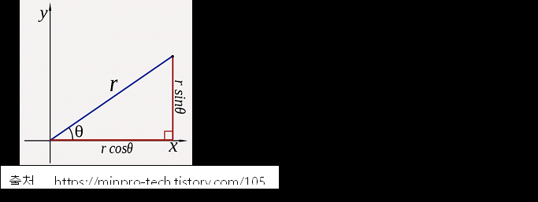

# 6장. 객체와 자료 구조

인스턴스 변수를 private 접근제어자로 작성하는 이유는 남들이 변수에 의존하지 않게 만들고 싶어서이다. 그런데 왜 getter 와 setter를 명시해서 해당 변수에 대한 접근을 외부에 노출할까?

## 자료 추상화



```java
public class Point {
    public double x;
    public double y;
}

```
```java
public interface Point {
    double getX();
    double getY();
    void setCartesian(double x, double y);
    double getR();
    double getTheta();
    void setPolar(doube r, double theta);
}

```
두 클래스 모두 2차원의 점을 표현하는 클래스이다. 하지만 아래쪽 클래스는 직교좌표계를 나타내는지 극좌표계를 나타내는지 알 길이 없다.
반면 위쪽 클래스는 명백히 직교좌표계를 나타낸다. 하지만 위쪽 클래스는 x와 y값을 설정하는 함수를 제공한다면 구현을 외부로 노출하게 된다.
변수 사이에 함수라는 계층을 넣는다고 해서 무조건 구현이 저절로 감춰지는 것은 아니다. 구현을 감추기 위해서는 추상화가 필요하다.

```java
public interface Vehicle {
  double getFuelTankCapacityInGallons();
  dobule getGallonsOfGasoline();
}

```
```java
public interface Vehicle {
  double getPercentFuelRemaining();
}

```
위의 두 예시도 마찬가지이다.
자료를 세세하게 공개하기보다는 추상적인 개념으로 표현하였다.
개발자는 객체가 포함하는 자료를 표현할 가장 좋은 방법을 심각하게 고민해야 한다.
아무 생각 업싱 조회/설정 함수를 추가하는 방법이 가장 나쁘다.

## 자료/객체 비대칭

본 절에서는 자료와 객체 사이에 벌어진 차이를 기반으로 항상 객체가 옳은 것 만은 아니라는 것을 보여준다.
객체는 추상화 뒤로 자료를 숨긴 채 자료를 다루는 함수만 공개한다.
반면, 자료 구조는 자료를 그대로 공개하며 별다른 함수는 제공하지 않는다.

```java
public class Square {
  public Point topLeft;
  public double side;
}


public class Rectangle {
  public Point topLeft;
  public double height;
  public double width;
}


public class Circle {
  public Point center;
  public double radius;
}


public class Geometry {
  public final double PI = 3.141592653589793;


  public double area(Object shape) throws NoSuchShapeException {
    if (shape instanceof Square) {
      Square s = (Square)shape;
      return s.side * s.side;
    }else if (shape instanceof Rectangle) {
      Rectangle r = (Rectangle)shape;
      return r.height * r.width;
    }else if (shape instanceof Circle) {
      Circle c = (Circle)shape;
      return PI * c.radius * c.radius;
    }
    throw new NoSuchShapeException();
  }
}

```

위 예시를 보면 클래스가 절차적이기 때문에 객체지향스럽지 못하다. 라고 느낄 수 있다.
틀린 말은 아니지만, Geometry클래스에 새로운 둘레 길이를 구하는 perimeter() 메서드를 추가한다고 생각해보자.
그 어느 도형 클래스에도 영향이 생기지 않는다. 하지만 도형 클래스를 새롭게 추가한다면, Geometry 클래스에 속한 함수를 모두 고쳐야 한다.
두 조건(객체 || 자료구조)은 서로 정 반대이다.

이번엔 다형성을 적용한 객체지향적인 도형 클래스를 보도록 하자.

```java
public class Square implements Shape {
  private Point topLeft;
  private double side;


  public double area() {
    return side * side;
  }
}


public class Rectangle implements Shape {
  private Point topLeft;
  private double height;
  private double width;


  public double area() {
    return height * width;
  }
}

```

여기서 area메서드는 다형 메서드이다.
Geometry 클래스는 필요 없고, 그러므로 새 도형을 추가해도 기존 함수에 아무런 영향을 미치지 않는다.
반면 새로운 메서드를 추가한다면, 모든 도형 클래스에 새로운 메서드를 추가해주어야 한다.
다시 말해, 객체와 자료구조는 근본적으로 상호 보완적인 특질이 있고, 양분된다.
항상 객체만 올바른 것이 아니라, 변경에 따라 자료구조가 올바를 때도 있다.

## 디미터 법칙

디미터 법칙은 모듈은 자신이 조작하는 객체의 속사정을 몰라야 한다는 법칙이다.
좀더 정확하게 표현하자면, 디미터 법칙은 "클래스 C의 메서드 f는 다음과 같은 객체의 메서드만 호출해야 한다"라고 주장한다.
-	클래스 C
-	f가 생성한 객체
-	f인수로 넘어온 객체
-	C 인스턴스 변수에 저장된 객체

```java
public class SomeClass{
  private static final int saved = 13;//C 인스턴스 변수에 저장된 객체
  public List<Integer> someMethod(NumberInfo number){
     List<Integer> numbers = new ArrayList<>();


     this.anotherMethod();//클래스 C의 객체
     savedNum = saved * number.getInteger();//f 인수로 넘어온 객체
     numbers.add(savedNum);//f가 생성한 객체
     //…
     return numbers;
  }
}
```

하지만 위의 경우에서도 반환된 객체의 메서드를 호출해서는 안된다.
- `final String outputDir = ctxt.getOptions().getScratchDir().getAbsolutePath();`

결국 디미터의 법칙을 어기기 때문이다. 흔히 이렇게 "메서드의 반환타입"의 메서드를 부르는 코드를 '기차충돌'이라고 부른다.

### 기차충돌
위 기차충돌 코드는 아래와 같이 누는 편이 좋다.
- `Options opts = ctxt.getOptions();`
- `File scratchDir = opts.getScratchDir();`
- `final String outputDir = scratchDir.getAbsolutePath();`

물론 각 ctxt, opts, scratchDir이 객체인지, 자료 구조인지에 따라 디미터 법칙의 위반 여부는 달라진다.
객체라면 내부 구조를 숨겨야 하므로 위반한 것이고, 자료 구조라면 당연히 내부 구조를 노출하므로 디미터 법칙이 적용되지 않는다.

### 잡종 구조
잡종 구조는 절반은 자료구조, 절반은 객체인 구조를 말한다.
잡종 구조는 중요한 기능을 수행하는 함수도 있고, 공개 변수나 공개 조회/설정 함수도 있다.
이런 잡종 구조는 새로운 함수는 물론이고 새로운 자료 구조도 추가하기 어렵다.
양쪽 세상(데이터 중심, 객체 중심)에서의 단점만을 모아 놓은 구조이기 때문이다.
때문에 잡종 구조는 되도록 피하는 편이 좋다.
프로그래머가 함수나 타입을 보호할지 공개할지 확신하지 못해 어중간하게 내놓은 설계에 불과하다.

### 구조체 감추기
조금 복잡해졌으니, 내용을 조금 정리해보자.
ctxt를 통해 상대경로로부터 절대경로를 얻어냈다.
왜 절대경로가 필요한 것일까?
이 모듈을 쭉 읽어보니, 절대경로를 기반으로 임시경로를 만든다.

임시경로를 만드는 로직은 아래와 같았다.
```java
String outFile = outputDir + "/" + className.replace(',', '/') + ".class";
FileOutputSream fout = new FileOutputStream(outFile);
BufferedOutputStream bos = new BufferedOutputStream(fout);

```
모듈에서 ctxt를 호출할 때, ctxt가 객체라면 ctxt에게 "이렇게 해!"라고 메시지를 던져야지 속을 드러내라고 하면 안된다.

크레이그 라만의 GRASP 패턴에서도 위와 비슷한 내용을 언급한다.
- 정보 전문가에게 책임을 할당하라.
- 메시지는 메시지를 수신할 객체가 아니라 메시지를 전송할 객체의 의도를 반영해서 결정해야 한다.
- 책임 중심의 설계에서의 기본이다.

아주 간단하다. 모듈 어딘가에서 임시경로를 받을 수 있도록 "임시경로 만들어줘"라고 협력 대상에게 메시지를 전송하면,
협력 대상은 임시경로를 만들어주면 되는 것이다.
대신 임시경로를 만들 수 있는 책임을 갖는 대상에게 요청을 해야 한다.

- `Ctxt.createScratchFileStream(classFileName);`

이렇게 하니 ctxt의 내부 구조를 드러내지 않고, 모듈에서는 여러 객체를 탐색할 필요도 없이 원하는 결과를 얻을 수있었다.
따라서 디미터 법칙을 준수할 수 있었다.


## 자료 전달 객체
자료 구조체의 전형적인 형태는 공개 변수만 있고 함수가 없는 클래스다.
이런 자료 구조체를 때로는 자료 전달 객체(DTO;Data Transfer Object)라고 한다.
DTO는 DB와 통신하거나 소켓에서 받은 메시지 구문을 분석할 때 유용하다.
DTO는 DB에 저장된 가공되지 않은 정보를 가공하여 객체화할 때 가장 처음으로 사용하는 구조체다.

좀더 일반적인 형태는 빈(Bean)구조다.
빈은 비공개 변수를 조회/설정(getter, setter) 함수로 조작한다.
일종의 사이비 캡슐화로, 일부 OO 순수주의자나 만족시킬 뿐 별다른 이익을 제공하지 않는다.

```java
public class Address {
    private String street;
    private String streetExtra;
    private String city;
    private String state;
    private String zip;


    public void Address(String street, String streetExtra, String city, String state, String zip) {
        this.street = street;
        this.streetExtra = streetExtra;
        this.city = city;
        this.state = state;
        this.zip = zip;
    }


    public String getStreet() {
        return street;
    }


    public String getStreetExtra() {
        return streetExtra;
    }


    public String getCity() {
        return city;
    }


    public String getState() {
        return state;
    }


    public String getZip() {
        return zip;
    }
}
```

### 활성 레코드
활성 레코드는 DTO의 특수한 형태다.
공개변수나 비공개 변수에 getter, setter 메서드가 존재하는 자료구조이지만, save 나 find와 같은 탐색 함수도 제공한다.
활성 레코드는 DB 테이블이나 다른 소스에서 자료를 직접 변환한다.
하지만 이는 바람직하지 않다. 앞서 언급했던 잡종 구조가 되기 떄문이다.

활성 레코드는 자료 구조로 취급한다.
비즈니스 규칙을 담으면서 내부 자료를 숨기는 객체는 따로 생성한다.

## 결론
객체는 동작을 공개하고 자료를 숨긴다.
기존 동작을 변경하지 않으면서 새 객체 타입을 추가하기는 쉽지만, 새 동작을 추가하는 것은 어렵다.

이와 반대로 자료 구조는 별다른 동작 없이 자료를 노출한다.
때문에 기존 자료 구조에 새 동작을 추가하기는 쉽고, 새 자료 구조를 추가하기는 어렵다.

둘 중에 어떤 것이 옳고 그르다는 것이 아니다.
우수한 소프트웨어 개발자는 편견 없이 이 사실을 이해해 직면한 문제에 더 적합한 해결책을 선택해야한다.
